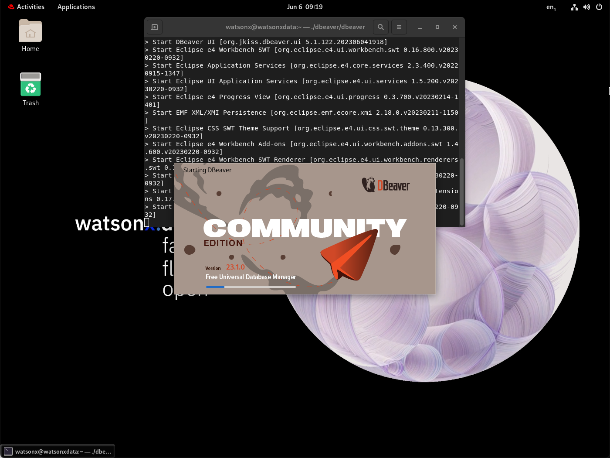
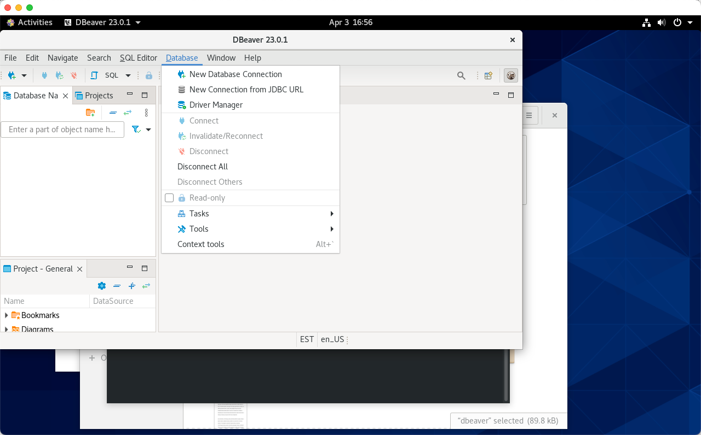
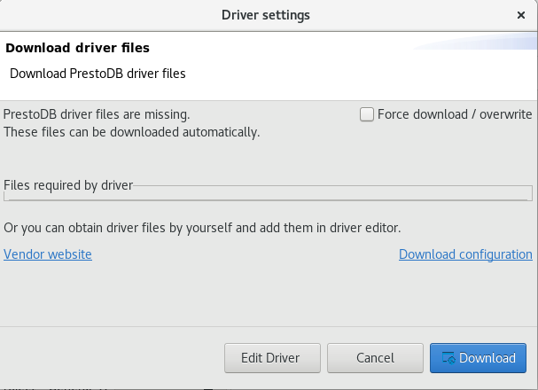

# Presto UI
Presto includes a browser interface. The PrestoDB console UI can be accessed from:

   * Presto console - http://ussouth.techzone-services.com:xxxxx
   * VMWare Image - http://localhost:8080/ui
   * Credentials: userid: None required
   
   
 
## dBeaver Client Tool
This is a client tool that we can use to connect to the IBM watsonx.data and execute queries etc. The tool has been installed in the watsonx users home directory. To access dBeaver, you must use one of the following options:

   * Use the Techzone guacamole interface and connect to the virtual machine console and deal with the pain and agony of using a non-resizable window.
   * Use the VNC service which has been installed on this server for you.
   * Use the native Linux Gnome terminal with VMWare/VirtualBox

### Retrieve SSL Certificates
Make sure you are still connected as root in your terminal session. We need to copy some keystore data into a temporary location to use with dBeaver connectivity. Make sure you are connected as root in a terminal session.

**Note**: We need two certificates from Presto to use with other query products (i.e., Apache Superset).
```
docker cp ibm-lh-presto:/mnt/infra/tls/lh-ssl-ts.jks /tmp/lh-ssl-ts.jks
docker cp ibm-lh-presto:/mnt/infra/tls/cert.crt /tmp/lh-ssl-ts.crt
```

### Start dBeaver Locally (VNC)
To start dBeaver, you must be connected to the console of the Linux server as the watsonx user. You can either use the VNC interface or the local terminal UI of Linux. Open a new terminal window inside the virtual machine and run the following command.
```
./dbeaver/dbeaver
```
The start-up screen for dBeaver will display.

 
 
The dBeaver program may ask if you want to create an empty database or update the release. Just say No.

 

The first dialog from dBeaver will ask you to create a database connection.


 
If you do not see this screen, select Database, and then select New Database Connection:


 
### Catalog IBM watsonx.data Connection
We will use the PrestoDB JDBC connector (NOT PrestoSQL). This is the other name for Trino, a variant of PrestoDB which might work. Select SQL (see Left side) and scroll down until you see PrestoDB. 


 
Select PrestoDB and then press “Next”. The following screen will be displayed.


 
Enter the following values into the dialog. 
**Note**: These settings are case sensitive.
``` 
Host=localhost
Port=8443
Username=ibmlhadmin
Password=password
Database=tpch
```
Then select the Driver Properties tab. You will be asked to download the database driver.

 

Make sure select “Force Download” otherwise it will not properly download the driver. Once downloaded it will display the Driver properties dialog.


 
Press the [+] button on the bottom left of the User Properties list.
 
You need to enter two properties:

   * <mark>SSL True</mark>
   * <mark>SSLKeyStorePath /tmp/lh-ssl-ts.jks</mark>

Enter the property name “SSL”, in uppercase (the parameter is case sensitive!). When you hit OK it will display the setting in the list.


  
Click on the SSL field and you will update the value to True and hit Enter.
Add another field called SSLKeyStorePath and give it value of /tmp/lh-ssl-ts.jks. The panel should now contain two values.

 
Press Finish when done. You should now see the TPCH database on the left panel.
 
Clicking on the >TPCH line should display the tables that are found in the database.
 
You can now use dBeaver to navigate through the different schemas in the Presto database.

## Local dBeaver Access
If you want to use a local copy of dBeaver, you will need to make some changes to your local system and the IBM watsonx.data system to connect. The instructions in the previous section require some slight modifications.
 
First locate the Presto connection port in your reservation document.

   * Presto Port - Server: eu-de.techzone-services.com Port: 35752

In a terminal window on your local machine, issue the following command to determine the IP address of your TechZone server.
```
ping eu-de.techzone-services.com
```
<tt fontsize=6>
PING eu-de.techzone-services.com (149.81.9.250): 56 data bytes
64 bytes from 149.81.9.250: icmp_seq=0 ttl=52 time=157.459 ms
</mark>
Note: Your server will be different! The FRA04 server is shown above.

This IP address needs to be placed into your local hosts file. On OSX, use the following command with the IP address found above.
```
echo '149.81.9.250 ibm-lh-presto-svc' | sudo tee -a /etc/hosts
```
In a terminal window on the IBM watsonx.data server, issue the following commands:
```
sudo firewall-cmd --add-port={8443/tcp,5432/tcp} --permanent --zone=public
sudo firewall-cmd --reload
```
In your connection properties in dBeaver, use the following values:
```
Host=ibm-lh-presto-svc
Port=8443
Username=ibmlhadmin
Password=password
Database=tpch
```
And remember to add these connection properties.

   * SSL True
   * SSLKeyStorePath /tmp/lh-ssl-ts.jks
   
You should now be able to connect to the Presto engine using your local dBeaver software.

