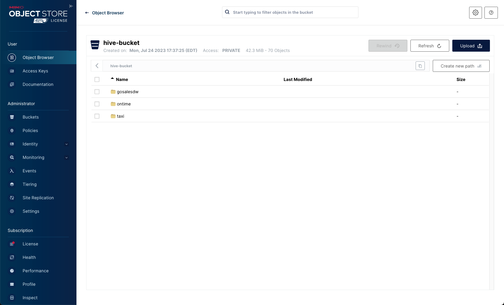
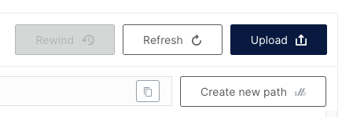
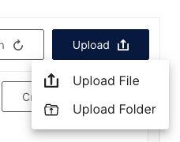
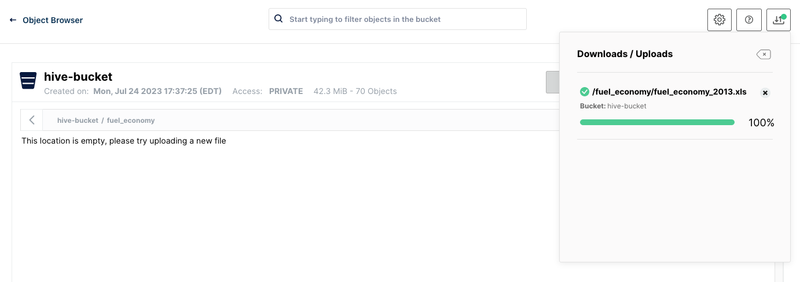
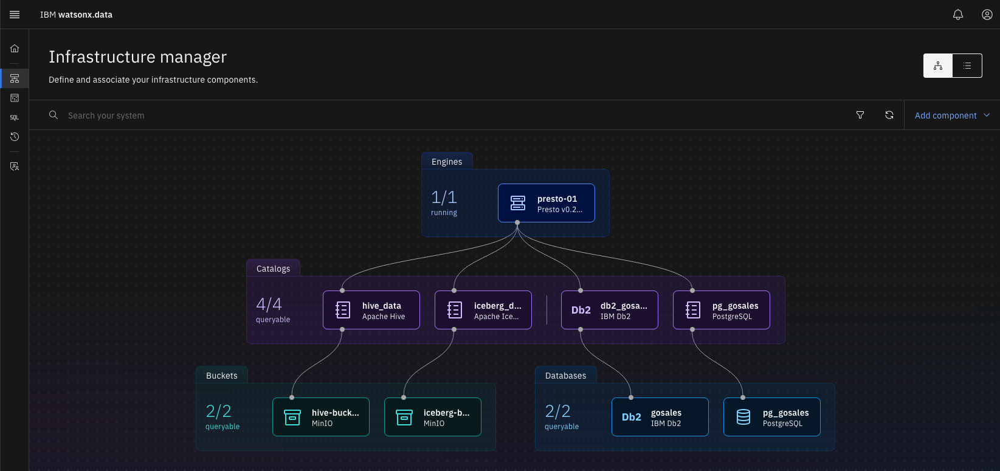
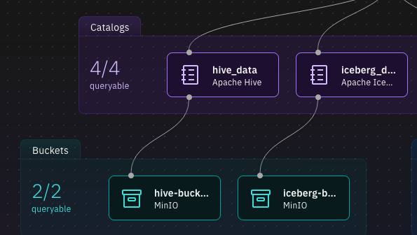
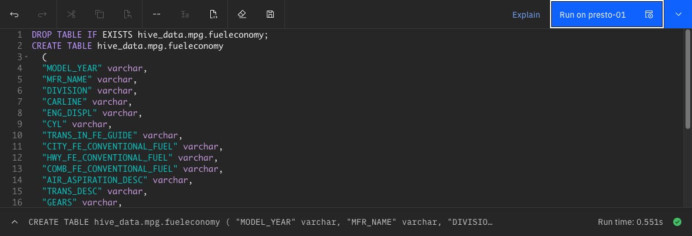
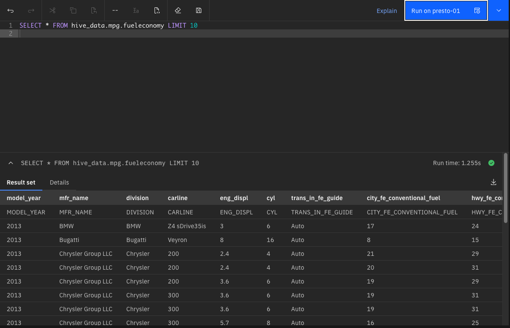

# External Datasets

There are a variety of data sets available for you to load from external sites. Check out the following websites for a variety of public data sets that you can use.

* <a href="https://github.com/awesomedata/awesome-public-datasets" target="_blank">Awesome Public Datasets</a>
* <a href="https://www.kaggle.com/datasets" target="_blank">Kaggle Datasets</a>
* <a href="https://data.gov/" target="_blank">US Data.Gov</a>
* <a href="https://archive.ics.uci.edu/datasets" target="_blank">UCI Machine Learning Repository</a>
* <a href="https://www.fueleconomy.gov/feg/download.shtml" target="_blank">US Fuel Economy</a>

**Note**: These sites have not been checked for license restrictions on the use of the data. You are responsible for checking that the data can be used without any licensing requirements.

## Loading your own data

You can use a browser or link to an external file repository (i.e., Box) and download data directly to your workstation. Data can be CSV, Parquet, JSON, or TXT formats. Once the data is on your workstation, use the following steps. 

**Note**: You cannot import customer data nor any data that has restrictions associated with its use. Any use of private data is in violation of the terms and conditions of using this image.

The first step is to connect to MinIO. Extract the MinIO credentials by using the `passwords` command:
```
passwords text
```


Open your browser and navigate to:

   * Minio console - <a href="http://192.168.252.2:9001" target="_blank">http://192.168.252.2:9001</a>
   

 
Login with object store credentials found above (These will be different for your system). You should see the current buckets in MinIO. If you don't see the buckets, click on Object Browser on the left-hand side panel.


Select `hive-bucket` from the list of buckets.



You may see other directories in this list than what is shown above. You will need to create a new path for your data set. 



Create a new directory name for your data (fuel_economy was used for this example). 


MinIO will display an empty directory and suggest you load something into it.


Use the Upload button on the far right side to point to your dataset on your local machine. 



In this example, we are using a CSV file for the 2013 fuel economy estimates for automobiles sold in the US. You may need to rename you datasets to eliminate blanks and any other special characters other than "`_`" or "`-`".


The display will show the progress of the upload into the bucket.



You may need to refresh your browser to see the file in the bucket.


Now that the data has been loaded into a bucket, you can catalog it in the watsonx.data UI. If you created a new bucket for this data set, you will need to register it first in the watsonx.data UI. Instructions for how to do this are found in the [Working with Object Store Buckets](wxd-objectstore.md) section.

Start by navigating to the watsonx.data UI and look at the Infrastructure manager. 



Find the bucket where you upload your data set into and note the catalog name that it is associated with. Here we can see that the `hive-bucket` bucket is associated with the `hive_data` catalog.



In the watsonx.data UI, select the Query workspace (SQL) icon. You will need to create a schema that links to this data set. The format of the command is shown below.

<pre style="color: darkgreen; overflow: auto">
DROP SCHEMA catalog.schema_name;
CREATE SCHEMA catalog.schema_name 
  WITH ( location = 's3a://your-bucket/data_directory' );
</pre>

You will need to change the following values:

* catalog - The catalog that the bucket you are using is associated with
* schema_name - A schema name to associate your tables with
* data_directory - The directory in which your file is located
* your_bucket - The bucket the data physically resides in

For the fuel economy example, using `mpg` as the schema, the You neSQL would be:

```
DROP SCHEMA hive_data.mpg;
CREATE SCHEMA hive_data.mpg 
  WITH ( location = 's3a://hive-bucket/fuel_economy' );
```

Run this SQL against the Presto engine:


The `DROP` command may fail if the schema doesn't exist, but the `CREATE` should work. 

The next step is to define what the table looks like for watsonx.data to be able to query it. The syntax of the `CREATE TABLE` statement is similar to:

<pre style="color: darkgreen; overflow: auto">
CREATE TABLE catalog.schema.tablename
   (
   "column_name"     "type",
   ...
   )
WITH ( format = 'CSV', 
       csv_separator = ',', 
       external_location = 's3a://your_bucket/data_directory');
</pre>

You will need to create a table definition for your CSV file in order to catalog it in watsonx.data. Note that the **only** data type that is permitted for CSV columns is `varchar`. This is a restriction of the current driver. Plans are to update it to include other data types over time.

If your data set does not include a header row (a row that defines the column names), you will need to create the table definition manually. 

If the data set does contain a header record, you can use the following Python code to generate a `CREATE TABLE` statement. You will need to make sure that `pandas` is available.

```
python3 -m pip install pandas --user
```

Next run the `python3` command in the shell to run an interactive Python session.

```
python3
```

Place the following code into your Python window.

```
def showcsv(catalog, schema, tablename, bucket, directory, csv_in):
    import pandas as pd
    df = pd.read_csv(csv_in,na_values="-")
    df = df.fillna(0)
    column_headers = list(df.columns.values)
    print("")
    print(f"DROP TABLE IF EXISTS {catalog}.{schema}.{tablename};")
    print(f"CREATE TABLE {catalog}.{schema}.{tablename}")
    print("  (")
    comma = ""
    end = ""
    for header in column_headers:   
        print(f"{comma}",end=end)
        comma = ","
        end   = "\n"
        print(f'  "{header}" varchar',end="")
    print(f"  )") 
    print(f"WITH (")
    print(f"     format = 'CSV',")
    print(f"     csv_separator = ',',")
    print(f"     external_location = 's3a://{bucket}/{directory}'")
    print(f"     );")
    print("")

def makesql():
    catalog = input("Catalog   : ")
    schema  = input("Schema    : ")
    table   = input("Table     : ")
    bucket  = input("Bucket    : ")
    dir     = input("Directory : ")
    csv     = input("CSV File  : ")
    showcsv(catalog,schema,table,bucket,dir,csv)

```

Gather the following information on your dataset:

* catalog - The catalog the schema and table are created under (`hive_data`)
* schema - The schema name that you created to hold your table (`mpg`)
* table name - The name of the table (`fuel_economy`)
* bucket - Where the data is located (`hive-bucket`)
* directory - What directory contains your data (`fuel_economy`)
* csv_in - The location on your local machine where the csv file is 

Once you have gathered that, run the following command in your Python window and answer the prompts.

```
makesql()
```
<pre style="font-size: small; color: darkgreen; overflow: auto">
>>> makesql()
Catalog   : hive_data
Schema    : mpg
Table     : fueleconomy
Bucket    : hive-bucket
Directory : fuel_economy
CSV File  : ~/Downloads/fuel_economy_2013.csv

DROP TABLE IF EXISTS hive_data.mpg.fueleconomy;
CREATE TABLE hive_data.mpg.fueleconomy
  (
  "MODEL_YEAR" varchar,
  "MFR_NAME" varchar,
  "DIVISION" varchar,
  "CARLINE" varchar,
  "ENG_DISPL" varchar,
  "CYL" varchar,
  "TRANS_IN_FE_GUIDE" varchar,
  "CITY_FE_CONVENTIONAL_FUEL" varchar,
  "HWY_FE_CONVENTIONAL_FUEL" varchar,
  "COMB_FE_CONVENTIONAL_FUEL" varchar,
  "AIR_ASPIRATION_DESC" varchar,
  "TRANS_DESC" varchar,
  "GEARS" varchar,
  "DRIVE_DESC" varchar,
  "FUEL_UNIT_CONVENTIONAL_FUEL" varchar,
  "FUEL_UNIT_DESC_CONVENTIONAL_FUEL" varchar,
  "ANNUAL_FUEL_COST_CONVENTIONAL" varchar,
  "FUEL_METERING_SYS_DESC" varchar  )
WITH (
     format = 'CSV',
     csv_separator = ',',
     external_location = 's3a://hive-bucket/fuel_economy'
     );
</pre>

Cut and paste the output from the command into the watsonx.data Data Explorer window to create the file.



Now you can query the table with the following SQL. Note that the header record still exists in the answer set since we did not remove it from the CSV file.

```
SELECT * FROM hive_data.mpg.fueleconomy LIMIT 10
```

