# Federation with IBM watsonx.data
IBM watsonx.data can federate data from other data sources, there are a few out of box connectors and one could create additional connectors using the SDK if need be (This does involve some programming and testing effort) and not a trivial exercise. We will use the existing PostgreSQL instance, add some data, and test the federation capabilities. 

Open the developer sandbox and use existing scripts to create a PostgreSQL database and add some data.

Switch to the bin directory as the root user.

```
cd /root/ibm-lh-dev/bin
```

Connect to the sandbox.
```
./dev-sandbox.sh 
```
Create the database.
```
/scripts/create_db.sh pgdatadb
```
<pre style="font-size: small; color: darkgreen; overflow: auto">
exists result: 
CREATE DATABASE
</pre>

Connect to the Database.
```
/scripts/runsql.sh pgdatadb
```
<pre style="font-size: small; color: darkgreen; overflow: auto">
psql (11.19, server 13.4 (Debian 13.4-4.pgdg110+1))
WARNING: psql major version 11, server major version 13.
         Some psql features might not work.
Type "help" for help.
</pre>

Create a Table.
```
create table t1( c1 int, c2 int);
```
<pre style="font-size: small; color: darkgreen; overflow: auto">
CREATE TABLE
</pre>
Insert some sample data.
```
insert into t1 values(1,2);
```
<pre style="font-size: small; color: darkgreen; overflow: auto">
INSERT 0 1
</pre>

Quit Postgres.
```
quit
```

Quit Sandbox.
```
exit
```
### Postgres Properties
To set up federation, we need to get the credentials for the Postgres database.
Use the following command to get the database password.
```
export POSTGRES_PASSWORD=$(docker exec ibm-lh-postgres printenv | grep POSTGRES_PASSWORD | sed 's/.*=//')
echo "Postgres Userid   : admin"
echo "Postgres Password : " $POSTGRES_PASSWORD
echo $POSTGRES_PASSWORD > /tmp/postgres.pw
```
**Note**: The following steps are currently done manually to set up Postgres federation. This will be automated by GA.

Open your browser and connect to the IBM watsonx.data UI:

   * IBM watsonx.data UI - <mark>https://ussouth.techzone-services.com:xxxxx</mark>
   * VMWare Image - <mark>https://localhost:9443/</mark>
   
Navigate to the Infrastructure manager by clicking on the icon below the Home symbol.

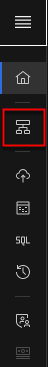
  
You should a panel like the following.

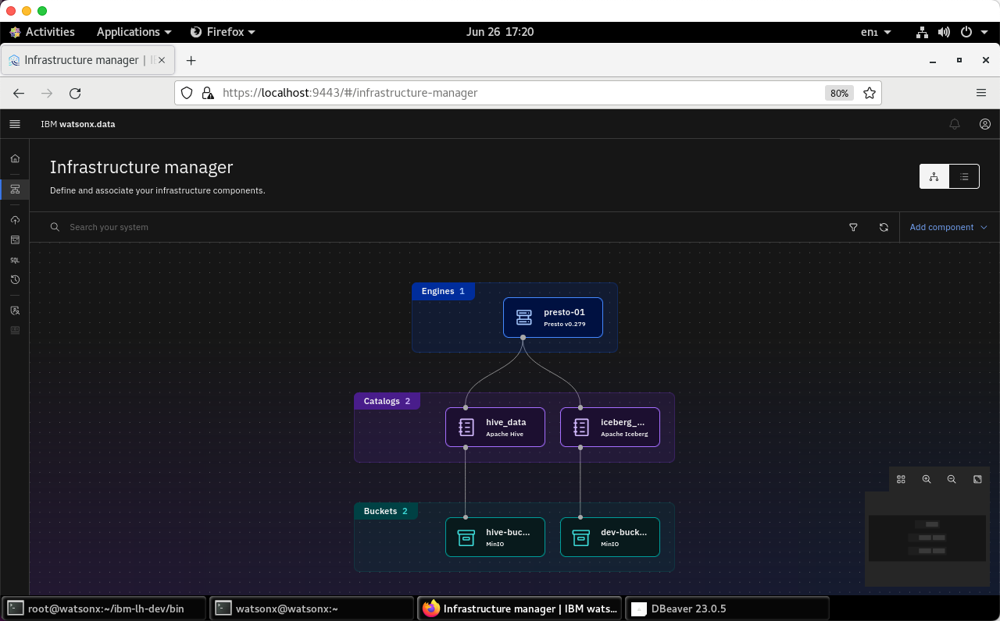
 
On the top right-hand corner, select Add Component->Add database.


 
The Add database dialog is displayed.

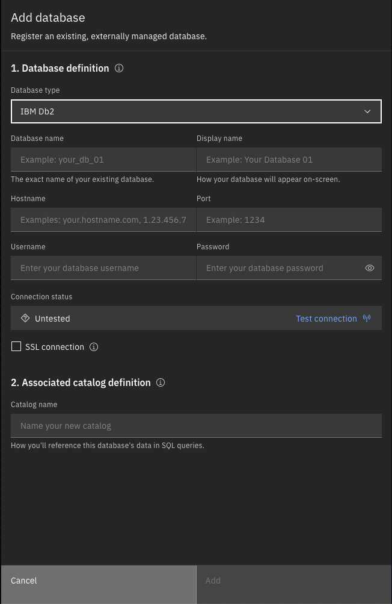
      
Enter the following values:

   * Database type – <mark>Postgres</mark>
   * Database name – <mark>pgdatadb</mark>
   * Hostname – <mark>ibm-lh-postgres</mark>
   * Port – <mark>5432</mark>
   * Display name – <mark>pgdatadb</mark>
   * Username – <mark>admin</mark>
   * Password – The value that was extracted in the earlier step
   * Catalog Name – <mark>pgdatadb</mark>
   
Your screen should look like the one below. Press "Add".

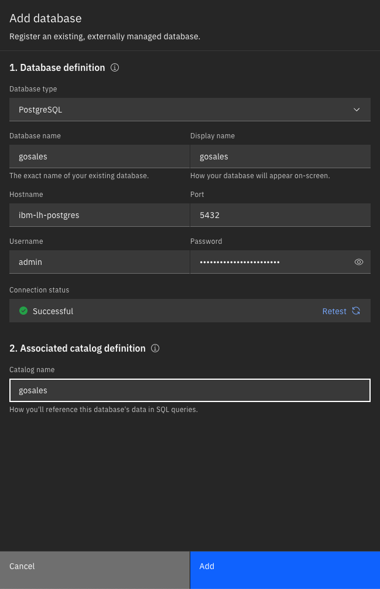

The infrastructure screen should now show the Postgres database.

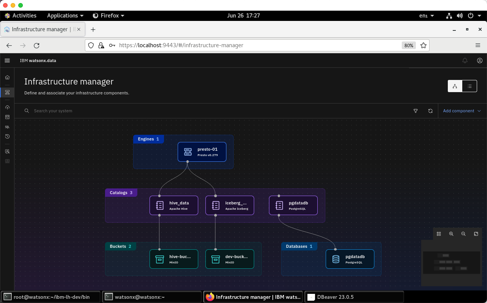
 
What we are currently missing the connection between the Presto engine and the Postgres data in pgdatadb. We must connect the pgdatadb database to the Presto engine. Use your mouse to hover over the pgdatadb icon until you see the Associate connection icon:

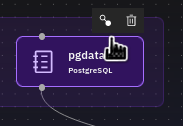
 
Click on the association icon. You should see the following confirmation dialog:

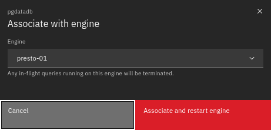
 
Press the Associate button and the screen will update to show the connection.

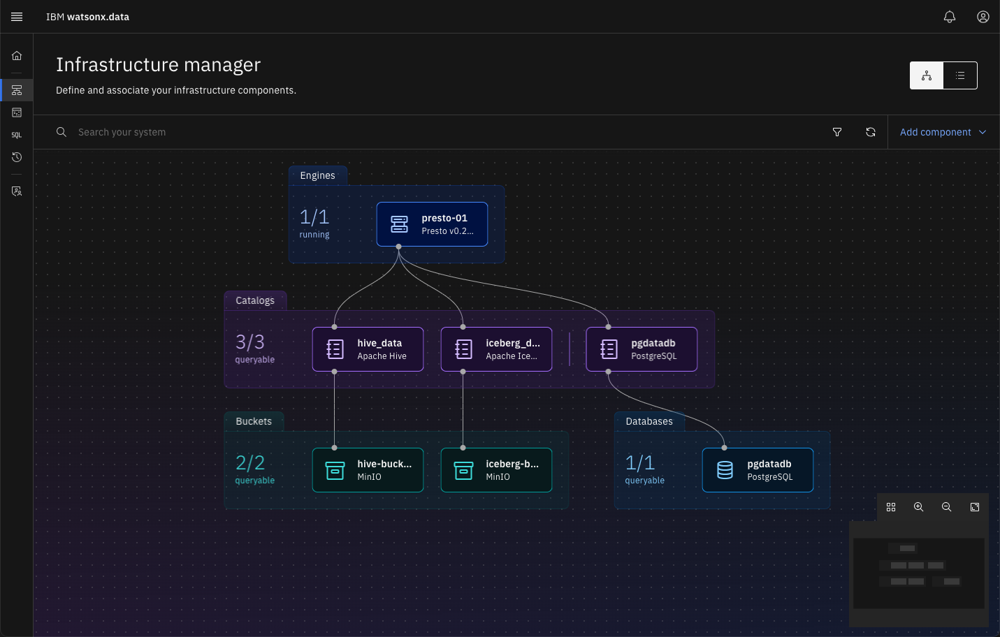
 
The dialog says that it will restart the engine, but it doesn’t always happen. In the terminal window, stop and restart the Presto engine. 
 
```
./stop_service.sh ibm-lh-presto
./start_service.sh ibm-lh-presto
./checkpresto.sh
```
<pre style="font-size: small; color: darkgreen; overflow: auto">
Inspecting docker image ibm-lh-presto before removal:
ibm-lh-presto still running. Removing ibm-lh-presto...
ibm-lh-presto

FYI: LH_RUN_MODE is set to diag
49cf2c7020e3727d4fa9c1bd43c9f1774e6ff6cd26bd2980678e6aa24af059cc
Waiting for Presto to start.
....................
Ready
</pre>
Once this command completes, refresh the browser, and then continue onto the next step.

### Presto Federation
Connect to IBM watsonx.data and try Federation.
```
./presto-cli.sh --catalog pgdatadb
```
Show the current schemas.
```
show schemas;
```
<pre style="font-size: small; color: darkgreen; overflow: auto">
       Schema       
--------------------
pg_catalog         
 public             
(2 rows)
</pre>
Use the public schema.
```
use public;
```
Select the table we created in Postgres.
```
select * from public.t1;
```
<pre style="font-size: small; color: darkgreen; overflow: auto">
 c1 | c2 
----+----
  1 |  2 
(1 row)
</pre>
 
Join with data from other schemas (Sample TPCH+PostgreSQL).
```
select t1.*,customer.name from tpch.tiny.customer, pgdatadb.public.t1 limit 10;
```
<pre style="font-size: small; color: darkgreen; overflow: auto">
c1 | c2 |        name        
----+----+--------------------
  1 |  2 | Customer#000000001 
  1 |  2 | Customer#000000002 
  1 |  2 | Customer#000000003 
  1 |  2 | Customer#000000004 
  1 |  2 | Customer#000000005 
  1 |  2 | Customer#000000006 
  1 |  2 | Customer#000000007 
  1 |  2 | Customer#000000008 
(10 rows)
</pre>

Quit Presto.
```
quit;
```

## Optional: IBM watsonx.data Control Database
Some of the control information used by IBM watsonx.data can be found in a local Postgres database called ```ibm_lh_repo```. 

If you are attempting to connect from your local dBeaver program, you must open the Postgres ports inside the Virtual Machine by issuing these commands.
```
sudo firewall-cmd --add-port={8443/tcp,5432/tcp} --permanent --zone=public
sudo firewall-cmd --reload
```
Use the dBeaver menu to create a new database connection using the following information:
   
   * Database Type: <mark>Postgresdb</mark>
   * Host (VNC): <mark>localhost</mark> Port: <mark>5432</mark>
   * Database: <mark>ibm_lh_repo</mark>
   * Userid: <mark>admin</mark> Password: (cat /tmp/postgres.pw to see the value)

If you are using the local connection, you will need to get host and port information from the TechZone reservation:

   * Postgres Port - Server: <mark>ussouth.techzone-services.com Port: xxxxx</mark>

Your database connection screen should look like the following panel.

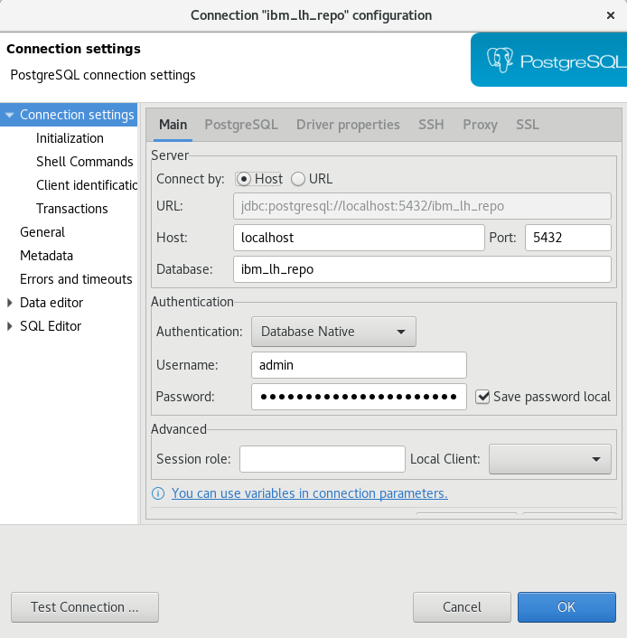
 
You may be asked to download the Postgres driver. Make sure to select “Force Driver Download” to get the latest driver.

When you have connected to the database, navigate down the ibm_lh_repo connection to the public schema. Select “Tables” and you should see the various catalogs that are used in the system.

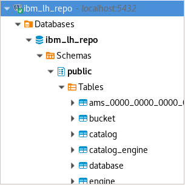
 
Click on the "catalog" table and this should result in several rows being shown on the screen. You can browse the control tables to see what the system keeps track of.

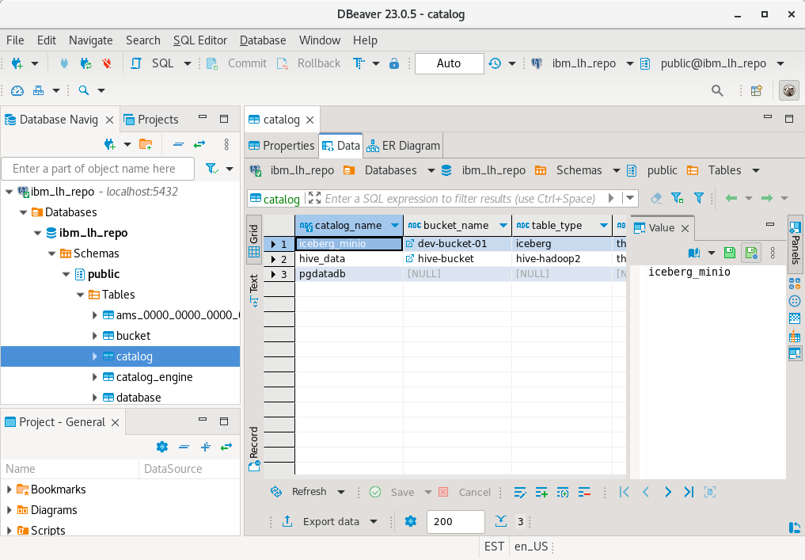
 
 

