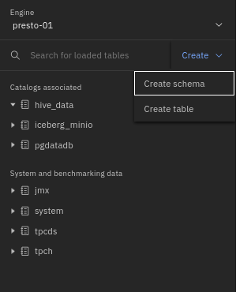
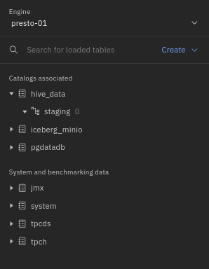
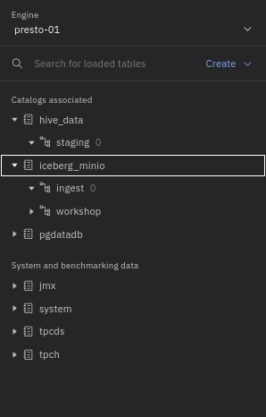
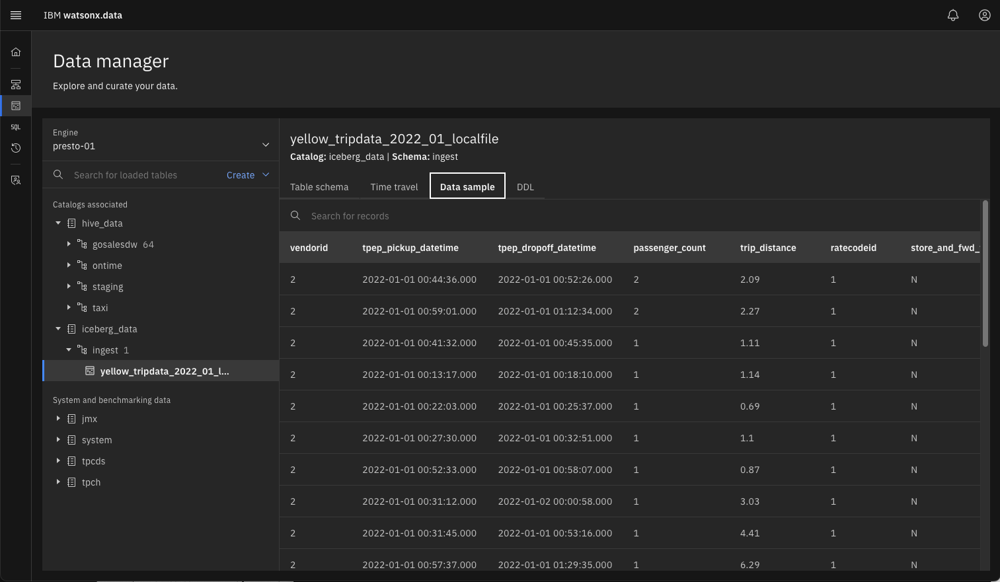
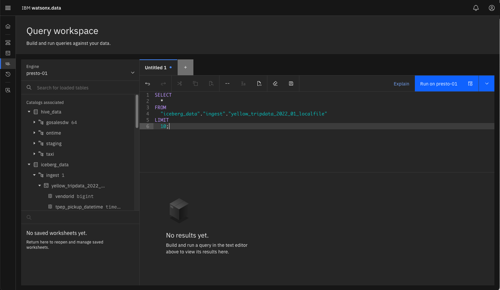
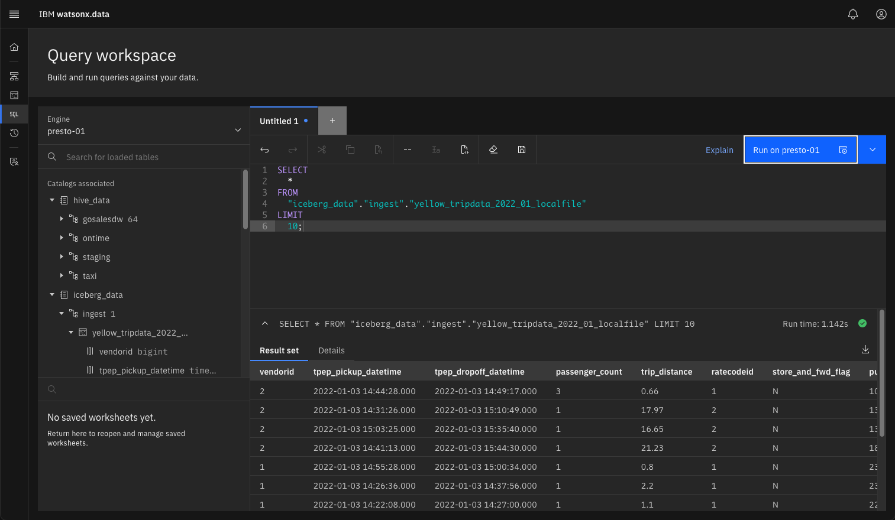

# Ingesting Data

In this lab we will install the ingest tool (lh-tool) alongside the IBM watsonx.data developer edition that is running in this lab. The Ingest tool is a separate install and currently needs to be downloaded after IBM watsonx.data is started. The lab image contains a copy of this code so you will not need to download it.

In addition, there is a staging file (yellowtaxi-parquet) found in root’s directory that will be used for loading into the system.

As the `root` user, switch to the developer bin directory.
```
cd /root/ibm-lh-dev/bin
```
Start the Ingest container.
```
docker run --network ibm-lh-network -v /root/staging:/staging --name ibm-lh-tools -dt us.icr.io/nz-cloud/ibmlh-datacopy:v1.0-beta
```
### Start and stop ingest container

The ingest tool is outside of the control of the IBM watsonx.data dev environment that you have been using in the labs.  Using ./bin/start or ./bin/stop will not start or stop the ingest container. If you need to Start or Stop the service, use the following commands.

   * Stop the ibm-lh-tools container: 
     ```
     docker stop ibm-lh-tools
     ```
   * Start the ibm-lh-tools container: 
     ```
     docker start ibm-lh-tools
     ```
### Ingest data into the IBM watsonx.data
Before running the utility, we need to retrieve several credentials for MinIO and the 
keystore password. 
```
export LH_S3_ACCESS_KEY=$(docker exec ibm-lh-presto printenv | grep LH_S3_ACCESS_KEY | sed 's/.*=//')
export LH_S3_SECRET_KEY=$(docker exec ibm-lh-presto printenv | grep LH_S3_SECRET_KEY | sed 's/.*=//')
export LH_KEYSTORE_PASSWORD=$(docker exec ibm-lh-presto printenv | grep LH_KEYSTORE_PASSWORD | sed 's/.*=//')
```
We need to generate three export lines that will be used later in another script. 
```
cat <<EOF > /root/staging/keys.sh
#!/bin/bash
export access_key=$LH_S3_ACCESS_KEY
export secret_key=$LH_S3_SECRET_KEY
export keystore_password=$LH_KEYSTORE_PASSWORD
EOF
chmod +x /root/staging/keys.sh
```
You need to get a copy of the the Minio SSL certificates by running the following command.
```
docker cp ibm-lh-presto:/mnt/infra/tls/lh-ssl-ts.jks /root/staging/lh-ssl-ts.jks
```
This will save the certificate file into a shared volume that is accessible by the ibm-lh docker container.

### Create a hive schema for staging the ingest file

Before ingesting the file, we need to create a new schema that we will use for the table being loaded. Open your browser and navigate to:

   * IBM watsonx.data UI - **https://192.168.252.2:9443**
   * VMWare Image - **https://localhost:9443/**

In the watsonx.data UI select the Data Explorer.


You should see a screen like the following.


 
Use the "Create" pulldown and select Create schema.  


 
Select the `hive_data` catalog and use `staging` as the new schema name.


 
Press the Create button to finish the creation of the schema.


 
You should see the new `staging` schema under `hive_data`. You need to repeat the same process again, but this time you are going to add a schema called `ingest` in the `iceberg_data` catalog.


 
You should see the new `ingest` schema in the navigator screen. 



### Start the IBM tools Container

To access the tools container, we need to use Docker commands, or use the Portainer console that is installed as part of this lab. To shell into the container used the following command.
```
docker exec -it ibm-lh-tools /bin/bash 
```
<pre style="font-size: small; color: darkgreen; overflow: auto">
///////////////////////////////////////
///////////////////////////////////////
        _                  _  _       
     _ | |__   _,   ,_    | || |_ _   
    | || '_ \ / /\//| |_ _| || |_  |  
    | || |_) || |   | |_ _| || | | |  
    |_||_.__/ |_|   |_|   |_||_| |_|  
///////////////////////////////////////
///////////////////////////////////////
</pre>
To get help on the utility, you can use the following command.
```
ibm-lh data-copy --help
```

**Note**: When you copy and paste into the docker container, you will need to press the Return or Enter key for the command to run. 

The image requires a fix to work with Developer edition code.
```
sed -i 's/hive-beta/hive_data/g' /opt/app-root/lib64/python3.9/site-packages/ibmlh/ingest/interfaces/external_table_loader.py
```
The next step creates a script file for loading the data. 
```
cd /staging
cat <<EOF > ingest-local.sh
#!/bin/bash
source ./keys.sh
table_name="iceberg_data.ingest.yellow_tripdata_2022_01_localfile"
file="yellow_tripdata_2022-01.parquet"
dir="/staging"

ibm-lh data-copy \\
   --source-data-files \${dir}/\${file} \\
   --target-tables \${table_name} \\
   --ingestion-engine-endpoint "hostname=ibm-lh-presto-svc,port=8443" \\
   --staging-location s3://iceberg-bucket/ingest/ \\
   --staging-s3-creds \\
"AWS_SECRET_ACCESS_KEY=\${secret_key}\\
,AWS_ACCESS_KEY_ID=\${access_key}\\
,AWS_REGION=us-east-1\\
,BUCKET_NAME=iceberg-bucket\\
,ENDPOINT_URL=http://ibm-lh-minio:9000" \\
    --create-if-not-exist \\
    --trust-store-path /staging/lh-ssl-ts.jks \\
    --trust-store-password \${keystore_password} \\
    --dbuser ibmlhadmin \\
    --dbpassword password
EOF
sed -i '/^$/d' ./ingest-local.sh
chmod +x ./ingest-local.sh
```
Now run the ingest job inside the tool container.
```
./ingest-local.sh
```
<pre style="font-size: small; color: darkgreen; overflow: auto">
Start data migration
Ingesting SECTION: cmdline
Reading parquet file:/staging/yellow_tripdata_2022-01.parquet
Inferring source schema...
Schema inferred
Ingesting source folder s3://iceberg-bucket/ingest/stage_1686085369_19_ea7fa9994c96/ into target table ingest.yellow_tripdata_2022_01_localfile

The specified table does not exist
Target table does not exist.. creating
Current State: RUNNING Rows Ingested: 408575
Current State: RUNNING Rows Ingested: 52
Current State: 100% FINISHED
Done ingesting into table: ingest.yellow_tripdata_2022_01_localfile
Complete migration
</pre>
 
After ingesting the data, exit the docker container.
```
exit
```
Refresh the IBM watsonx.data UI to view the iceberg_data catalog in the Data Explorer.


 
Click on the yellow_tripdata table to see the schema definition.


 
Then click on the Data sample tab to see a snippet of the data.


 
Now we can use the UI to run a query against this imported data. Select the SQL icon on the left side of the display.


 
On the line where the yellow_tripdate table is located, click the icon at the end of the name. This will display a drop-down list. Select "Generate SELECT".


 
This will generate a SQL statement in the window to the right of the table name.


 
Now execute the query to see what the results are.


 
That completes the labs! Congratulations you are done! 


