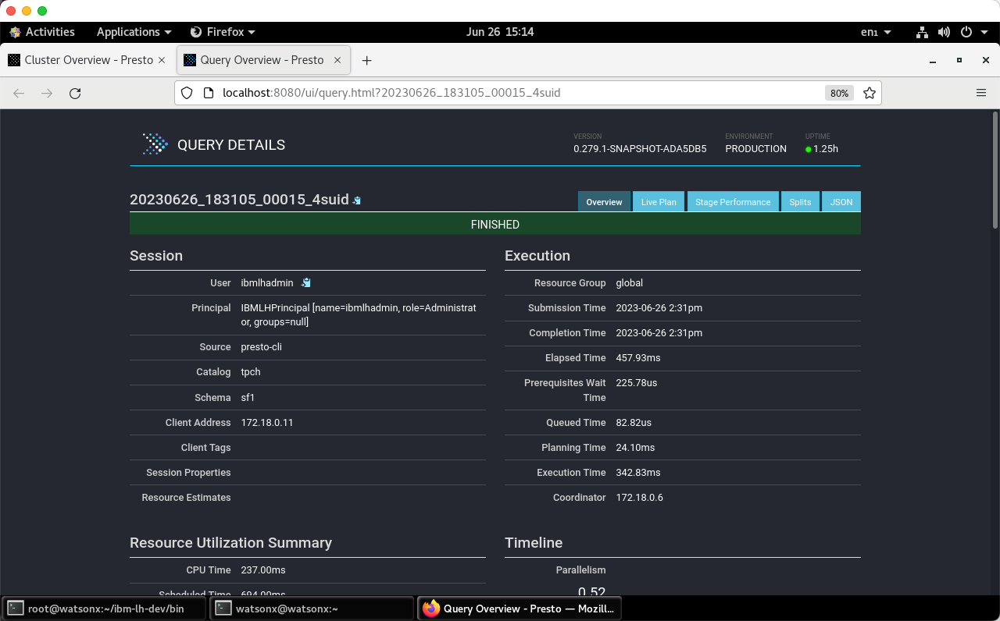

# Using the Presto console UI
The PrestoDB console UI can be accessed from:

   * Presto console - <a href="http://192.168.252.2:8080" target="_blank">http://192.168.252.2:8080</a>

The Presto console allows you to do the following:

   * Monitor state of the cluster
   * Queries being executed
   * Queries in queue
   * Data throughput 
   * Query details (text and plan)

**Note**: The Presto console is very valuable when it comes to diagnosing problems with any queries you run in the watsonx.data environment. If a query fails you can find more details in the Presto console using the instructions below.
   

 
On the main Presto screen, click the Finished Button (middle of the screen).


 
A list of finished queries will display below the tab bar. You can scroll through the list of queries and get details of the execution plans. If you scroll through the list, you should see the test query "select * from customer limit 5". If you had a query that failed, look for the SQL in this list and continue on with the next step.


 
Click on the query ID to see details of the execution plan that Presto produced.


 
You can get more information about the query by clicking on any of the tabs that are on this screen. For instance, the Live Plan tab will show a visual explain of the stages that the query went through during execution. Scrolling to the bottom of this screen will also display any error messages that may have been produced by the SQL.


Take time to check out the other information that is available for the query including the stage performance.

## System Connector 
The Presto System connector provides information and metrics about the currently running Presto cluster. You can use this function to monitor the workloads on the Presto cluster using normal SQL queries.

Make sure you are the `root` user and in the proper development directory.
```
cd /root/ibm-lh-dev/bin
```

Start the Presto CLI.
```
./presto-cli
```
What queries are currently running?
```
select * from "system".runtime.queries limit 5;
```
<pre style="font-size: small; color: darkgreen; overflow: auto">
          query_id           |  state   |    user    |      source      |                            query                            | resource_group_id | queued_time_ms | analysis_time_ms |         created         |         started         |     last_heartbeat      |           end           
-----------------------------+----------+------------+------------------+-------------------------------------------------------------+-------------------+----------------+------------------+-------------------------+-------------------------+-------------------------+-------------------------
 20230626_182942_00007_4suid | FINISHED | ibmlhadmin | presto-cli       | show tables                                                 | [global]          |              0 |               33 | 2023-06-26 18:29:40.628 | 2023-06-26 18:29:40.817 | 2023-06-26 18:29:41.095 | 2023-06-26 18:29:41.118 
 20230626_182938_00005_4suid | FINISHED | ibmlhadmin | presto-cli       | SHOW FUNCTIONS                                              | [global]          |              1 |              607 | 2023-06-26 18:29:36.718 | 2023-06-26 18:29:36.777 | 2023-06-26 18:29:37.707 | 2023-06-26 18:29:37.742 
 20230626_192655_00031_4suid | FINISHED | ibmlhadmin | presto-cli       | show schemas                                                | [global]          |              1 |              257 | 2023-06-26 19:26:53.739 | 2023-06-26 19:26:54.043 | 2023-06-26 19:26:54.845 | 2023-06-26 19:26:54.866 
 20230626_183851_00018_4suid | FINISHED | ibmlhadmin | nodejs-client    | select * from system.runtime.queries order by query_id desc | [global]          |              1 |               27 | 2023-06-26 18:38:49.169 | 2023-06-26 18:38:49.293 | 2023-06-26 18:38:50.084 | 2023-06-26 18:38:50.121 
 20230626_185405_00021_4suid | FINISHED | ibmlhadmin | presto-go-client | SHOW TABLES                                                 | [global]          |              0 |               56 | 2023-06-26 18:54:03.542 | 2023-06-26 18:54:03.729 | 2023-06-26 18:54:04.042 | 2023-06-26 18:54:04.041 
(5 rows)
</pre>
What tasks make up a query and where is the task running?
```
select * from "system".runtime.tasks limit 5;
```
<pre style="font-size: small; color: darkgreen; overflow: auto">
               node_id                |              task_id              |       stage_execution_id        |           stage_id            |          query_id           |  state   | splits | queued_splits | running_splits | completed_splits | split_scheduled_time_ms | split_cpu_time_ms | split_blocked_time_ms | raw_input_bytes | raw_input_rows | processed_input_bytes | processed_input_rows | output_bytes | output_rows | physical_written_bytes |         created         |          start          |     last_heartbeat      |           end           
--------------------------------------+-----------------------------------+---------------------------------+-------------------------------+-----------------------------+----------+--------+---------------+----------------+------------------+-------------------------+-------------------+-----------------------+-----------------+----------------+-----------------------+----------------------+--------------+-------------+------------------------+-------------------------+-------------------------+-------------------------+-------------------------
 17ffe5e1-affe-4339-b618-0f60723cabf4 | 20230626_194106_00035_4suid.1.0.0 | 20230626_194106_00035_4suid.1.0 | 20230626_194106_00035_4suid.1 | 20230626_194106_00035_4suid | FINISHED |      1 |             0 |              0 |                1 |                      14 |                 2 |                     0 |            5965 |             36 |                  5965 |                   36 |         7269 |          36 |                      0 | 2023-06-26 19:41:04.606 | 2023-06-26 19:41:04.618 | 2023-06-26 19:41:04.639 | 2023-06-26 19:41:04.665 
 17ffe5e1-affe-4339-b618-0f60723cabf4 | 20230626_194309_00038_4suid.1.0.0 | 20230626_194309_00038_4suid.1.0 | 20230626_194309_00038_4suid.1 | 20230626_194309_00038_4suid | FINISHED |      1 |             0 |              0 |                1 |                      15 |                 2 |                     0 |            6125 |             37 |                  6125 |                   37 |          866 |           5 |                      0 | 2023-06-26 19:43:07.346 | 2023-06-26 19:43:07.357 | 2023-06-26 19:43:07.385 | 2023-06-26 19:43:07.398 
 17ffe5e1-affe-4339-b618-0f60723cabf4 | 20230626_194106_00035_4suid.0.0.0 | 20230626_194106_00035_4suid.0.0 | 20230626_194106_00035_4suid.0 | 20230626_194106_00035_4suid | FINISHED |     16 |             0 |              0 |               16 |                      60 |                 1 |                   440 |            7096 |             36 |                  7269 |                   36 |         7269 |          36 |                      0 | 2023-06-26 19:41:04.611 | 2023-06-26 19:41:04.626 | 2023-06-26 19:41:04.634 | 2023-06-26 19:41:04.682 
 17ffe5e1-affe-4339-b618-0f60723cabf4 | 20230626_194309_00038_4suid.0.0.0 | 20230626_194309_00038_4suid.0.0 | 20230626_194309_00038_4suid.0 | 20230626_194309_00038_4suid | FINISHED |     17 |             0 |              0 |               17 |                     108 |                 2 |                   189 |            1100 |              5 |                   866 |                    5 |          866 |           5 |                      0 | 2023-06-26 19:43:07.356 | 2023-06-26 19:43:07.380 | 2023-06-26 19:43:07.380 | 2023-06-26 19:43:07.419 
 17ffe5e1-affe-4339-b618-0f60723cabf4 | 20230626_194431_00039_4suid.1.0.0 | 20230626_194431_00039_4suid.1.0 | 20230626_194431_00039_4suid.1 | 20230626_194431_00039_4suid | RUNNING  |      1 |             0 |              1 |                0 |                       0 |                 0 |                     0 |               0 |              0 |                     0 |                    0 |            0 |           0 |                      0 | 2023-06-26 19:44:29.346 | 2023-06-26 19:44:29.352 | 2023-06-26 19:44:29.353 | NULL                    
(5 rows)
</pre>

Quit Presto.
```
quit;
```