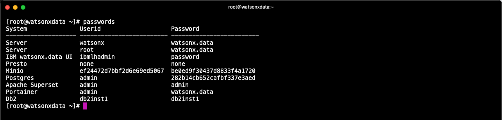
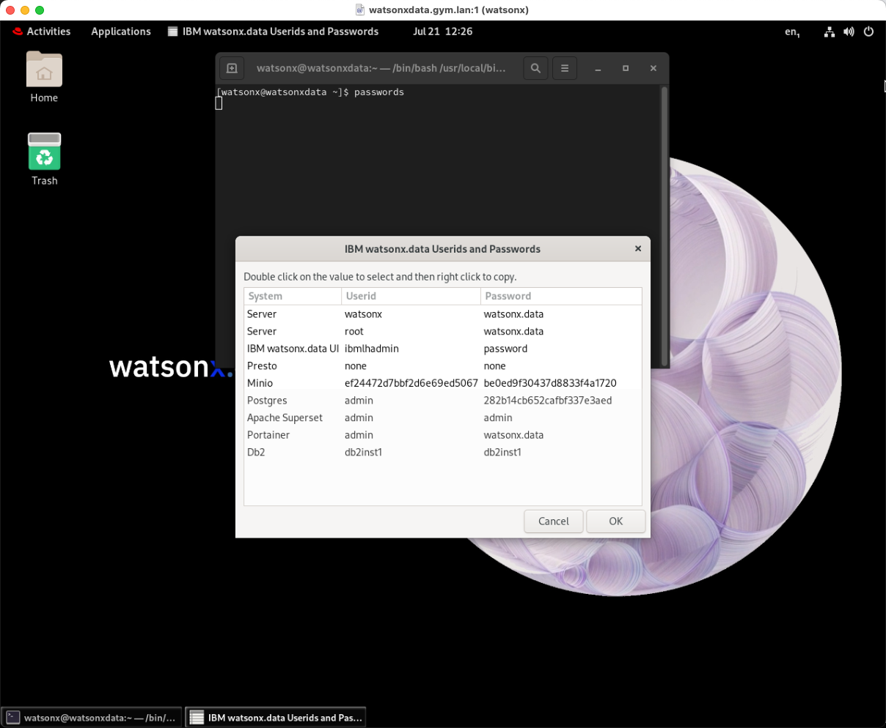

# Passwords

This table lists the passwords for the services that have "fixed" userids and passwords.

|Service|Userid|Password
|-------|------|--------|
|Virtual Machine|watsonx|watsonx.data
|Virtual Machine|root|watsonx.data
|IBM watsonx.data UI|ibmlhadmin|password
|Presto|None|None
|Minio|Generated|Generated
|Postgres|admin|Generated
|Apache Superset|admin|admin
|Portainer|admin|watsonx.data
|Db2|db2inst1|db2inst1

Use the following commands to get the generated userid and password for MinIO.
```
export LH_S3_ACCESS_KEY=$(docker exec ibm-lh-presto printenv | grep LH_S3_ACCESS_KEY | sed 's/.*=//')
export LH_S3_SECRET_KEY=$(docker exec ibm-lh-presto printenv | grep LH_S3_SECRET_KEY | sed 's/.*=//')
echo "MinIO Userid  : " $LH_S3_ACCESS_KEY
echo "MinIO Password: " $LH_S3_SECRET_KEY
```

Use the following command to get the password for Postgres.
```
export POSTGRES_PASSWORD=$(docker exec ibm-lh-postgres printenv | grep POSTGRES_PASSWORD | sed 's/.*=//')
echo "Postgres Userid   : admin"
echo "Postgres Password : " $POSTGRES_PASSWORD
```

You can get all passwords for the system when you are logged in as the <code style="color:blue;font-size:medium;">watsonx</code> user by using the following command.
```
passwords
```

If you receive the following message:
<pre style="font-size: medium; color: darkgreen; overflow: auto">
(zenity:29252): Gtk-WARNING **: 11:27:32.683: cannot open display:
</pre>

You will need to issue the command with the `text` option.
```
passwords text
```



When running this command from within the virtual machine, it will display a list that you can select values from.



**Note:** You cannot cut and paste values into the VNC window. 