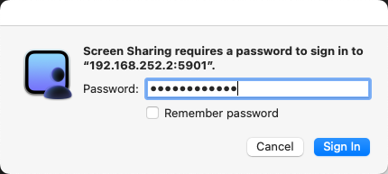
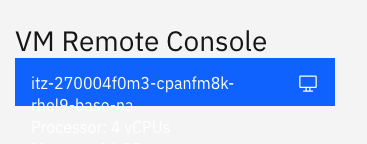

# Using VNC 

**Note**: Before using VNC, make sure that you have installed Wireguard and have activated the connection.

In order to access the console of the IBM watsonx.data server, a VNC service needs to be used. Once your reservation is active, you can connect to the machine console in one of two ways. The recommended approach is to use the VNC service that has been started on the machine. 

   * VNC for watsonx userid - <code style="color:blue;font-size:medium;">vnc://192.168.252.2:5901</code>

Use the Mac screen sharing app or an equivalent one on Windows (i.e., <a href="https://www.uvnc.com/downloads/ultravnc.html" target="_blank">UltraVNC</a>) to connect to watsonx. You can also connect using the Safari browser by using the URL provided. It will automatically start the screen sharing application.

**Note**: The VNC URL format is only valid in Safari and will not work in other browsers.
 
When the service connects to the server it will prompt for the password of the <code style="color:blue;font-size:medium;">watsonx</code> user - <code style="color:blue;font-size:medium;">watsonx.data</code>.

 
Once connected you will see the console of the watsonx user.

You may also want to consider making the screen size larger. Use the drop-down menu (Applications) at the top of the screen to select Other -> Settings. 

In the Devices section of the Setting menu, select Displays and choose a resolution that is suitable for your environment.

### TechZone Guacamole Access
**Do not use this interface unless you find that you are unable to connect using the VNC link provided**. The TechZone reservation document includes a link to the details of the virtual machine.

You can access the logon screen of the virtual machine by pressing the VM Remote Console button. **It is not recommended to use this interface for accessing the virtual machine.**

At the bottom of the reservation page you will find the console button.

Clicking on this button will display the logon screen for the server.

Select the <code style="color:blue;font-size:medium;">watsonx</code> user and use <code style="color:blue;font-size:medium;">watsonx.data</code> as the password.