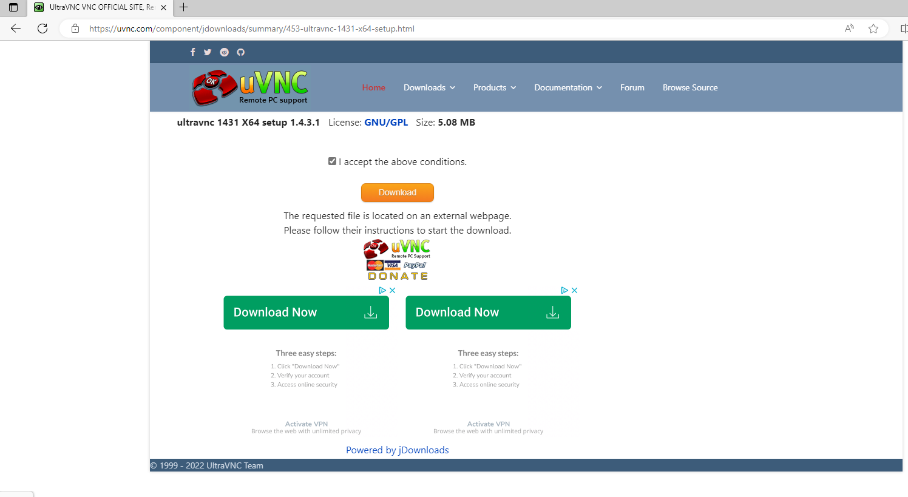
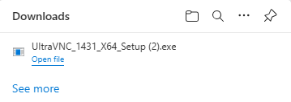
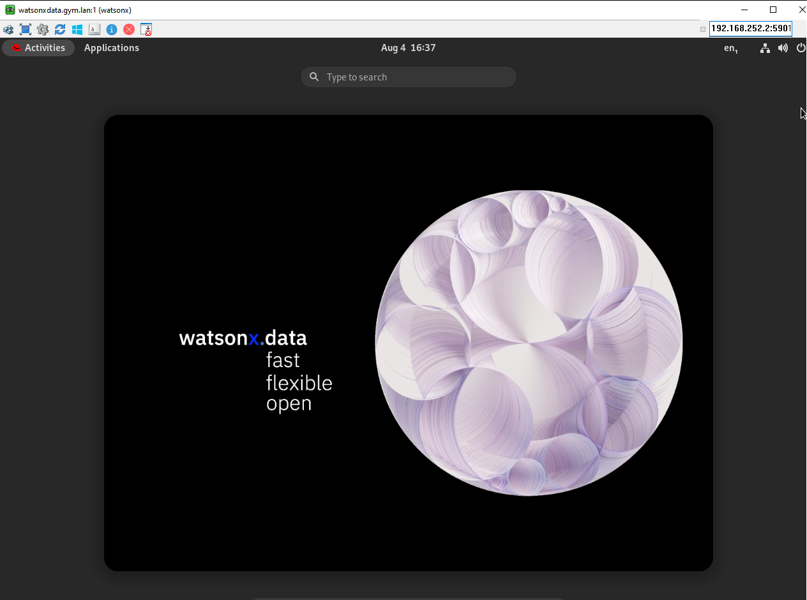
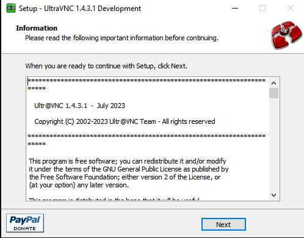
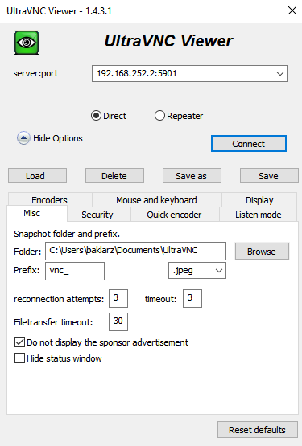
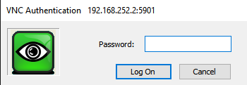

# Using VNC 

**Note**: Before using VNC, make sure that you have installed Wireguard and have activated the connection.

In order to access the console of the watsonx.data server, a VNC service needs to be used. Once your reservation is active, you can connect to the machine console in one of two ways. The recommended approach is to use the VNC service that has been started on the machine. 

   * VNC for watsonx userid (OSX) - <code style="color:blue;font-size:medium;">vnc://192.168.252.2:5901</code>
   * VNC for other VNC viewers - <code style="color:blue;font-size:medium;">192.168.252.2:5901</code>

Use the Mac screen sharing app or an equivalent one on Windows (i.e., UltraVNC) to connect to watsonx.data. See [UltraVNC Installation](#ultravnc-installation) instructions below.

You can connect using the OSX Safari browser by using the URL provided. It will automatically start the screen sharing application.

**Note**: The VNC URL format is only valid in Safari and will not work in other browsers.
 
When the service connects to the server it will prompt for the password of the <code style="color:blue;font-size:medium;">watsonx</code> user - <code style="color:blue;font-size:medium;">watsonx.data</code>.

**Note:** If you are using other VNC products like UltraVNC, you can only use 8 character passwords, so type in <code style="color:blue;font-size:medium;">watsonx.</code> as the password. The address on the UltraVNC tool requires you to use only the address (no VNC at the beginning).

```
192.168.252.2:5901
```


 
Once connected you will see the console of the watsonx user.


You may also want to consider making the screen size larger. Use the drop-down menu (Applications) at the top of the screen to select Other -> Settings. 


In the Devices section of the Setting menu, select Displays and choose a resolution that is suitable for your environment.


### TechZone Guacamole Access
**Do not use this interface unless you find that you are unable to connect using the VNC link provided**. The TechZone reservation document includes a link to the details of the virtual machine.

You can access the logon screen of the virtual machine by pressing the VM Remote Console button. **It is not recommended to use this interface for accessing the virtual machine.**

At the bottom of the reservation page you will find the console button.


Clicking on this button will display the logon screen for the server.


Select the <code style="color:blue;font-size:medium;">watsonx</code> user and use <code style="color:blue;font-size:medium;">watsonx.data</code> as the password.

## UltraVNC Installation

UltraVNC is a VNC browser for the Windows environment. This is an open-source offering that can be found on Github in the [UltraVNC project](https://github.com/ultravnc/ultravnc).

The developers of this code have additional offerings that they sell for a fee and use advertising on their site to support their work on this and other projects. Because of the way the website has been designed, there are a number of ads and buttons that might distract you from the actual product you want to download.

The official web page of UltraVNC is <a href="https://uvnc.com/" target="_blank">https://uvnc.com/</a>. Instead of going through all the menus, 
use the following link to go directly to the download screen:

* <a href="https://uvnc.com/component/jdownloads/summary/453-ultravnc-1431-x64-setup.html" target="_blank">UltraVNC Download Link</a>

The website will display an initial download page that will wait for 10 seconds before you can do anything. This gives you time to read the advertising or make a voluntary donation to their coding efforts.


Once the wait time has expired, you will see the following screen:



Make sure to check that you accept the above conditions and press the download button. You should see the download progress in your browser.


Click "Open File" against the downloaded file. 



Once the installer starts it will ask for you to approve changes to the system.


Press Yes and then select the language you want.


Press OK.


Select Accept the license agreement and press Next.


The summary of what it is going to install is shown on this screen. You will then have to provide the installation location or use the default location for the code.


The next panel asks which components you want to install. **Only** install the viewer.


Then it requests the name of the Shortcut folder. Just keep the name it recommends.


Press Next. The next panel comes up that asks if you want a desktop shortcut. Probably a good idea if you are going to use it for a long period of time. Notice how they make this install takes longer than expected to get you to donate?



After all of that you will see the final installation screen.


Click on Install and eventually you will get the completion notice.



Pressing Finish will give you one final chance to donate. Make sure to unselect "Show latest releases" or else you will be directed back to their website.


### Using UltraVNC

Start UltraVNC viewer by scrolling through your applications on your desktop. Choose the UltraVNC Viewer (not the listen mode ones **unless** you want to watch someone else using the desktop). 


When the service starts, it will ask for the server and port. Enter `192.168.252.2:5901` in this field. 


Before hitting enter, you may want to select the options button and change the setting in Miscellaneous to prevent advertising from being displayed while working with this program. 

Press connect when done.



The password for the service is `watsonx.` which is `watsonx` with a period `.` at the end.



At this point you should see the desktop of the virtual machine.


You are now connected and can work on the watsonx.data desktop.

If you find that performance is sluggish, this may be due to network latency. In the settings toolbar of the UltraVNC window, change the color resolution from `Full` to `256`. Your screen may look a bit washed out, but this will reduce the amount of data that needs to be sent over the network to render your screen.

