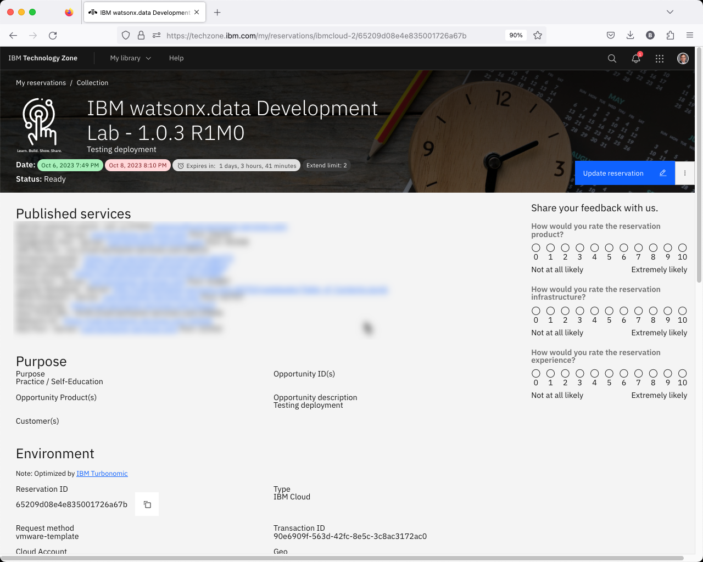
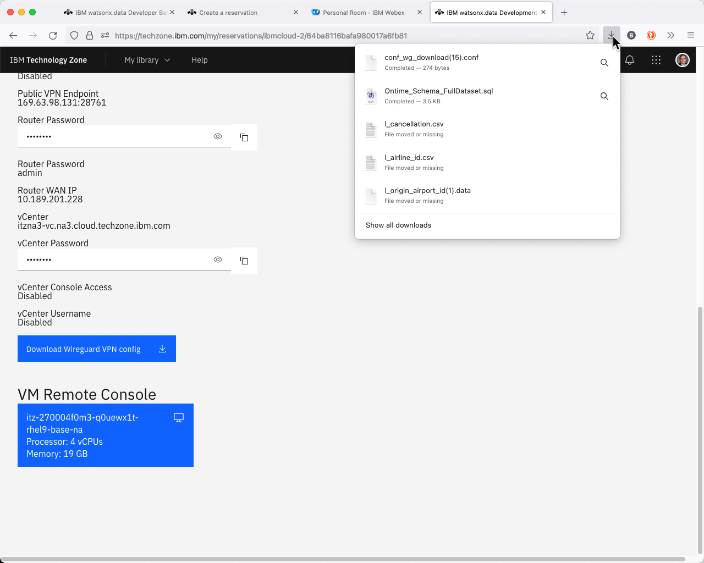
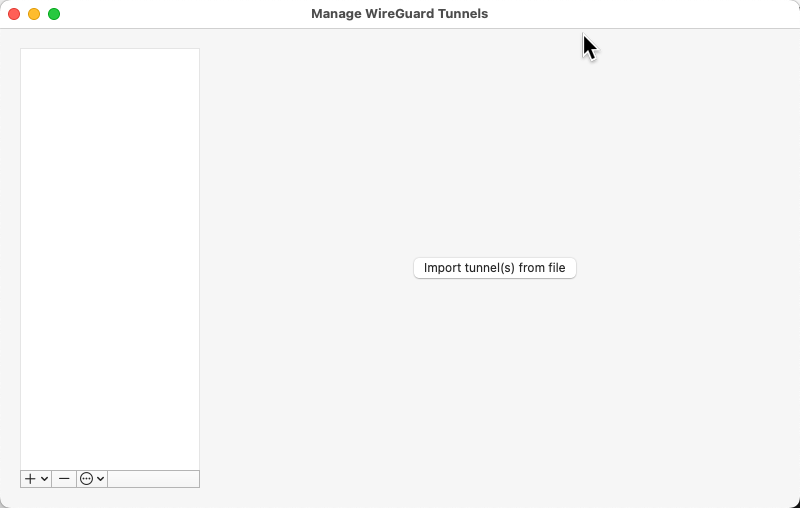
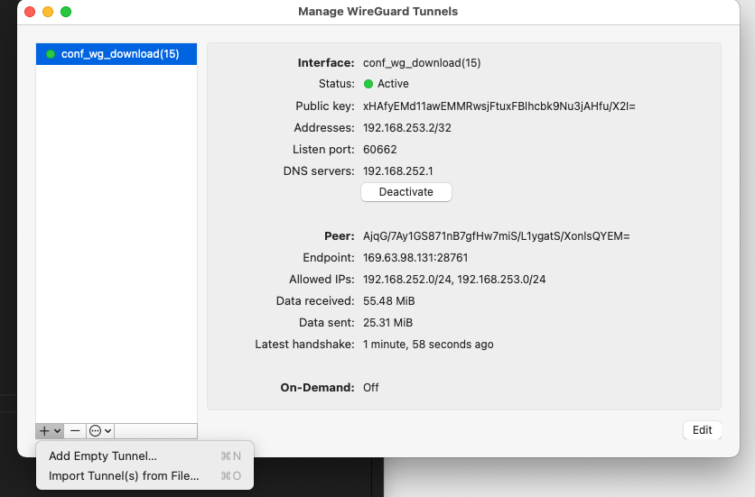
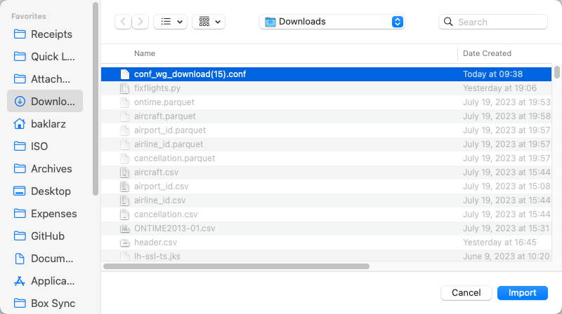
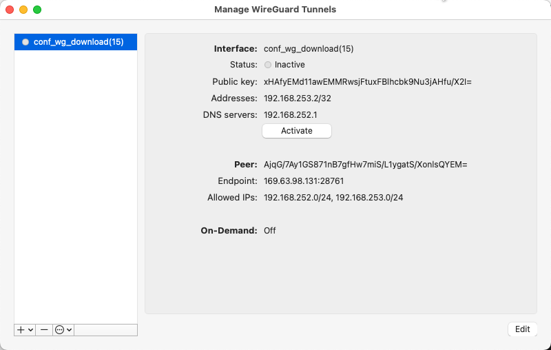
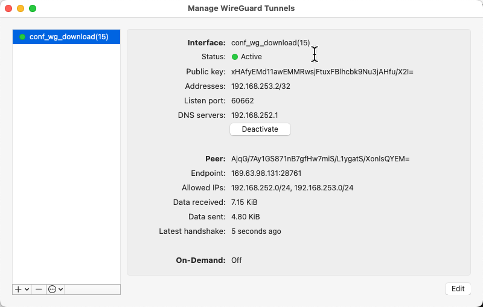

# Wireguard VPN Access

**Note:** If you cannot install a VPN program like Wireguard on your system, you will need to skip this section and use the VM Remote Console. See [Using VNC](wxd-reference-vnc.md#techzone-guacamole-access) for more details.

## Download the VPN Certificate

If you have not already downloaded the VPN certificate, follow these steps. 

Access your reservation from the TechZone site. Click on the arrows that corresponds to the watsonx.data reservation. 

When you click on the arrow the browser will display the details of your image.

Scroll down to the bottom of the web page to get the VPN certificate.

Click the Download VPN certificate to your machine and remember the filename for later use.

## Wireguard VPN Client

WireGuard uses state-of-the-art cryptography and network code to create an encrypted tunnel between two devices based on symmetric encryption. Wireguard can run at the same time as the IBM VPN client. 

If you do not have this software on your system, download the software from the following site.

<a href="https://www.wireguard.com/install/" target="_blank">https://www.wireguard.com/install</a>

Once you have the VPN downloaded, you must start the Wireguard VPN client. It will display a list of existing connections. The following system has no certificates loaded and immediately asks if you want to import a certificate.

If you have existing connections, the screen looks similar to this.

In the OSX (Mac) environment, press the [+] button in the bottom left corner of the list. 

Choose “Import Tunnels(s) from File”.

Here you can see the “cong_wg_download(15).conf” file is highlighted. Select the name of the file on your system to import it.

Now that the VPN configuration is in the list, select it and press the Activate button. You should see the Status turn on.
 
 

At this point, any IP addresses starting with 192.168.252.2 will route to your Lab machine. In addition, you will be able to use your Terminal session locally to shell into the server, without having to use the VM Console.

Once you are done with your lab, you should **disconnect the service**. Note that leaving this service on can sometimes cause IP address issues with other websites (even IBM internal sites!).

## Wireguard Not Starting

On the Mac, the Wireguard application will not always display in the Dock. If it doesn't appear to "start", it may be sitting in the Systray at the bottom or top of your screen. The icon will be gray if no connections are active.

 