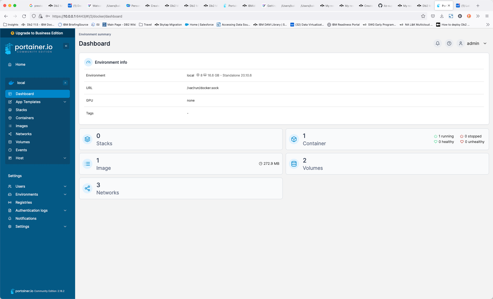

# Starting IBM watsonx.data

The Developer package is meant to be used on single nodes. While it uses the same code base, there are some restrictions, especially on scale. In this lab, we will open some additional ports as well to understand how everything works. We will also use additional utilities to illustrate connectivity and what makes the IBM watsonx.data "open". 

## Lab Instructions
Throughout the labs, any command that needs to be executed will be highlighted in a grey box:
```
cd /root/ibm-lh-dev/bin
```
Copy the text that is found within the box and paste it into the command window to execute. Note that some commands may span multiple lines, so make sure you copy everything in the box. Depending on your browser, you may see a copy icon on the far right side of the command.

## Start IBM watsonx.data Developer Edition

Make sure that you have an open terminal session and have switched to the root userid.
```
sudo su -
```

Switch to the development code bin directory.
```
cd /root/ibm-lh-dev/bin
```

Once you have switched to the development directory, you can start the IBM watsonx.data system. The <mark>LH_RUN_MODE</mark> flag is used to allow for non-SSL ports to be used in our development environment. The stop command ensure that we have a clean startup.
```
export LH_RUN_MODE=diag
./stop.sh
./start.sh 
```

**Note**: If you forget to set the <mark>LH_RUN_MODE</mark> flag, many of the URLs in the lab will be unreachable. If you find that you cannot connect to the URLs, you will need to stop the service and start it again.

The output will be like:
<pre style="font-size: small; color: darkgreen; overflow: scroll">
using /root/ibm-lh-dev/localstorage/volumes as data root directory for user: root/1001 
infra config location is /root/ibm-lh-dev/localstorage/volumes/infra

-- starting data plane containers...

==== starting: ibm-lh-minio ==== 
468339b93d94c78c1bb9bdcfe7f20ef0cc8d6c09725768847474b13bb51048e4
==== starting: ibm-lh-postgres ==== 
063643caeccd86f0612dbf587919f9b1c1681ab0e6632f04c7cd00bbd8f67596
==== starting: lh-hive-metastore ==== 
3d4ff7fb304fa4513642e289c290e3423827eef732d774c3be4229fe51601a9d
==== starting: ibm-lh-presto ==== 
3cc4313e53a784daf8b7747696bcd0260fe22d6abbaf8d749e50509d961066af

-- starting control plane containers...

==== starting: ibm-lh-control-plane-prereq ==== 
creating (if needed) db ibm_lh_repo
exists result: 
CREATE DATABASE
creating if needed, meta-repo tables in ibm_lh_repo
CREATE TABLE
CREATE TABLE
CREATE TABLE
CREATE TABLE
creating (if needed) db lakehouse-log
exists result: 
CREATE DATABASE
creating if needed, meta-repo tables in lakehouse-log
CREATE TABLE
==== starting: lhconsole-api ==== 
12fc73711934100cde1f6d4e633c28e2da0b9f4a804fe8923375669fcfeeb023
==== starting: lhconsole-javaapi ==== 
2c391fdcb68177346e6c73a26710da6101b9c19f52fa2ca2633a91bfcb95ae4c
==== starting: lhconsole-nodeclient ==== 
eca661eba3ba2fbef620438fe7986ebceb50c738bfdc0f08aeb3052e2560c8cb
==== starting: lhconsole-ui ==== 
efc6d69b051200ec85c2efd43dd884ec3a2e45304131065d1d7c09f3af464788
</pre>

### Check status of IBM watsonx.data
One the system has started; you can check the status with the following command.
```bash
./status.sh --all
```
Output will look like:
<pre style="font-size: small; color: darkgreen; overflow: scroll"">
using /root/ibm-lh-dev/localstorage/volumes as data root directory for user: root/1001 
infra config location is /root/ibm-lh-dev/localstorage/volumes/infra
lhconsole-ui				running			0.0.0.0:9443->8443/tcp, :::9443->8443/tcp
lhconsole-nodeclient-svc		running			3001/tcp
lhconsole-javaapi-svc			running			8090/tcp
lhconsole-api				running			3333/tcp, 8081/tcp
ibm-lh-presto				running			0.0.0.0:8443->8443/tcp, :::8443->8443/tcp
ibm-lh-hive-metastore			running			
ibm-lh-postgres				running			5432/tcp
ibm-lh-minio				running			
</pre>

To confirm that the software is working, run the following commands to validate the installation.

## Presto Engine Test
Check the Presto engine by connecting to a schema. First, we need to make sure that the Presto engine has completed all startup tasks.
```
./checkpresto.sh
```
<pre style="font-size: small; color: darkgreen">
Waiting for Presto to start.
...........................
Ready
</pre>

**Note**: If the starting message appears to take too long (fills up the entire line with dots), kill the command (CTRL-C) and restart the IBM watsonx.data image (this rare event occurs because of resource contention in our small machine). 

To restart the image, issue the following commands.
```
export LH_RUN_MODE=diag
./stop.sh
./start.sh
./checkpresto.sh
```
Once the command returns "Ready" you can connect to the presto CLI.
```
./presto-cli.sh --catalog tpch --schema tiny
```
Check the record count of the customer table. 

**Note**: If the Presto engine has not yet started (you didn't run the checkpresto script), the next command may result in a useless Java error message. You may need to wait for a minute for attempting to run the statement again.
```
select * from customer limit 10;
```
<pre style="font-size: small; color: darkgreen; overflow: auto">
 custkey |        name        |                address                | nationkey |      phone      | acctbal | mktsegment |                                                      comment                                                      
---------+--------------------+---------------------------------------+-----------+-----------------+---------+------------+-------------------------------------------------------------------------------------------------------------------
       1 | Customer#000000001 | IVhzIApeRb ot,c,E                     |        15 | 25-989-741-2988 |  711.56 | BUILDING   | to the even, regular platelets. regular, ironic epitaphs nag e                                                    
       2 | Customer#000000002 | XSTf4,NCwDVaWNe6tEgvwfmRchLXak        |        13 | 23-768-687-3665 |  121.65 | AUTOMOBILE | l accounts. blithely ironic theodolites integrate boldly: caref                                                   
       3 | Customer#000000003 | MG9kdTD2WBHm                          |         1 | 11-719-748-3364 | 7498.12 | AUTOMOBILE |  deposits eat slyly ironic, even instructions. express foxes detect slyly. blithely even accounts abov            
       4 | Customer#000000004 | XxVSJsLAGtn                           |         4 | 14-128-190-5944 | 2866.83 | MACHINERY  |  requests. final, regular ideas sleep final accou                                                                 
       5 | Customer#000000005 | KvpyuHCplrB84WgAiGV6sYpZq7Tj          |         3 | 13-750-942-6364 |  794.47 | HOUSEHOLD  | n accounts will have to unwind. foxes cajole accor                                                                
       6 | Customer#000000006 | sKZz0CsnMD7mp4Xd0YrBvx,LREYKUWAh yVn  |        20 | 30-114-968-4951 | 7638.57 | AUTOMOBILE | tions. even deposits boost according to the slyly bold packages. final accounts cajole requests. furious          
       7 | Customer#000000007 | TcGe5gaZNgVePxU5kRrvXBfkasDTea        |        18 | 28-190-982-9759 | 9561.95 | AUTOMOBILE | ainst the ironic, express theodolites. express, even pinto beans among the exp                                    
       8 | Customer#000000008 | I0B10bB0AymmC, 0PrRYBCP1yGJ8xcBPmWhl5 |        17 | 27-147-574-9335 | 6819.74 | BUILDING   | among the slyly regular theodolites kindle blithely courts. carefully even theodolites haggle slyly along the ide 
       9 | Customer#000000009 | xKiAFTjUsCuxfeleNqefumTrjS            |         8 | 18-338-906-3675 | 8324.07 | FURNITURE  | r theodolites according to the requests wake thinly excuses: pending requests haggle furiousl                     
      10 | Customer#000000010 | 6LrEaV6KR6PLVcgl2ArL Q3rqzLzcT1 v2    |         5 | 15-741-346-9870 | 2753.54 | HOUSEHOLD  | es regular deposits haggle. fur                                                                                   
(10 rows)
</pre>
Quit the Presto CLI. The Presto quit command can be used with or without a semicolon.
```
quit;
```

Congratulations, your system is now up and running!

# Portainer

This lab system has Portainer installed. Portainer provides an administrative interface to the Docker images that are running on this system. You can use this console to check that all the containers are running and see what resources they are using. Open your browser and navigate to:

   * Portainer console - https://ussouth.techzone-services.com:xxxxx
   * VMWare Image - https://localhost:6443/
   * Credentials: userid: <mark>admin</mark> password: <mark>watsonx.data</mark>

Once you have logged in, you should select “Get Started”.


The next screen displays the main control panel for Portainer.


Select the Local server.



This screen provides details on the containers, images, volumes, and networks that make up your docker installation. To view the containers that are running, select the container icon.


 
From within this view, you can view the details of any container, including the environment settings, the current logs, and allow you to shell into the environment. 
For more details on Portainer, see the [Portainer documentation](https://docs.portainer.io/user/home).