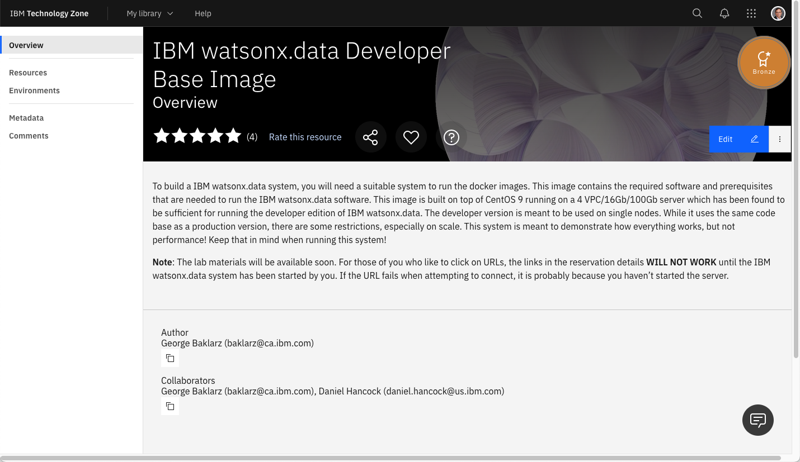
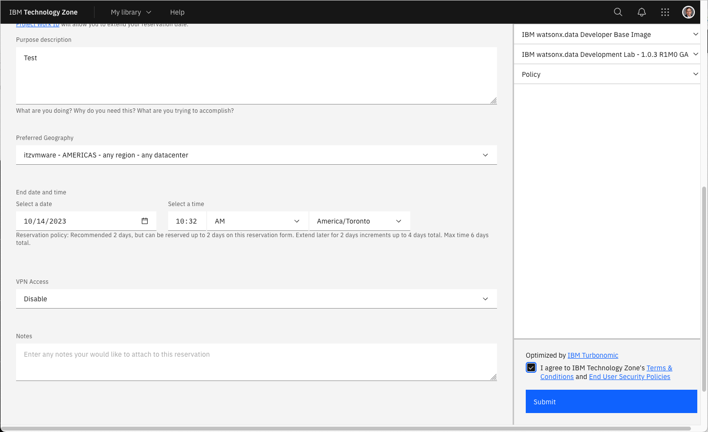
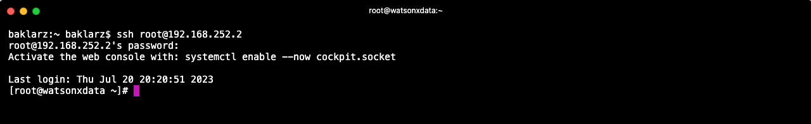

# IBM watsonx.data TechZone Image

There are two methods for running the IBM watsonx.data development system. One is to use an image on TechZone and the second is to run a virtual machine on your laptop. This section will describe the steps involved in using a TechZone image, while the next section will explain how to use a supplied VMWare image. 

## Requesting a TechZone image
Log into Techzone (https://techzone.ibm.com) and search for IBM watsonx.data
Developer Base Image or use the following link.

[https://techzone.ibm.com/collection/ibm-watsonxdata-developer-base-image](https://techzone.ibm.com/collection/ibm-watsonxdata-developer-base-image)

If you have not logged into the IBM Cloud site, you will be asked to
authenticate with your IBM userid. If you do not have an IBM userid, you will
need to register for one. This lab is open to IBMers and Business Partners. Once
you have logged in, you should see the following.


 
Select the Environment tab on the far-left side.


 
Press the Reserve button.


 
Select “reserve now” (why wait?).


 
For “Purpose” select Self Education. This will expand to request additional information.


 
Make sure to check "Not to be used with customer data".


 
Fill in the purpose field with something meaningful (IBM watsonx.data
education). Next select preferred Geography for the image.


Choose any of the regions that are closest to your location. For the Americas,
choose DAL10, but WDC04 can also be used if you find reservations are failing on
the Dallas datacenter. 

**Note**: During periods of high TechZone utilization, the provisioning of your
lab environment may fail. This is not an error with the lab itself, but a 
consequence of the popularity of running workloads on TechZone. The recommendation is to try to reserve the environment again and choose a different data center. To check the status of the TechZone environment, please refer to the .

Next select the end date for the lab.


Make sure you select enough time for you to use the lab! It defaults to 2 days, but you can extend the reservation! You **must** enable VPN Access. You will not be able to run the lab exercises without downloading the VPN certificate.  Once you have completed the form, click SUBMIT in the bottom right-hand corner.



At this point you will need to wait patiently for the request to be placed into
Provisioning mode.


Eventually you will receive the message that the system is now Ready. Of course,
you may also get a message telling you that the system provisioning has Failed.
I would suggest trying again. If DAL10 fails, try WDC04 or one of the other locations. 


The reservation email
from TechZone is extremely important since it lists all the ports that you will
be using to access the lab. Details on what these ports are used for are
described in the next section on URLs and Ports.

**Note**: Do not attempt to use these URLs until you read the section on Port usage and after you start the server.
 
## TechZone URLs and Ports 
The TechZone reservation does not provide any URLs to the services that you will be accessing in IBM watsonx.data. You will need to use the VPN certificate to access the ports that are used in the lab. The ports that are used in the lab are listed below.

   * <code style="color:blue;font-size:medium;">9443** - IBM watsonx.data management console
   * <code style="color:blue;font-size:medium;">8080** - Presto console
   * <code style="color:blue;font-size:medium;">9001** - MinIO console (S3 buckets)
   * <code style="color:blue;font-size:medium;">6443** - Portainer (Docker container management)
   * <code style="color:blue;font-size:medium;">**8088** - Apache Superset (Query and Graphing)
   * <code style="color:blue;font-size:medium;">5901** - VNC Access (Access to GUI in the machine)
   * <code style="color:blue;font-size:medium;">7681** - SSH (Terminal access) via Browser
   * <code style="color:blue;font-size:medium;">22** - SSH (Terminal access) via local terminal program
   * <code style="color:blue;font-size:medium;">8443** - Presto External Port (dBeaver connection)
   * <code style="color:blue;font-size:medium;">5432** - Postgres External Port (dBeaver connection)

Each of these services will have a URL and a specific port number assigned to it. The default port number when running inside the virtual machine are highlighed in **yellow**. 

Techzone versus VMWare image.

Click on this URL to access the UI in your local browser. The instructions in the lab will refer to a TechZone or VMware URL when asking for you to connect to a service. The following example asks you to connect to the UI.

Open your browser and navigate to:

   * IBM watsonx.data UI - **https://192.168.252.2:9443**
   * VMWare Image - **https://localhost:9443/**

If you need to manually enter the URL into a browser, make sure to use the port number (**xxxxx**) provided in the TechZone reservation document. It is recommended that you use the links provided in the reservation document to save yourself time and reduce the chances of incorrectly typing the URL.

## Virtual Machine Console
Once your reservation is active, you can connect to the machine console in one of two ways. The recommended approach is to use the VNC service that has been started on the machine. The VNC port address has been provided to you in the reservation document. 

   * VNC for watsonx userid - vnc://192.168.252.2:5901

Use the Mac screen sharing app or an equivalent one on Windows (i.e., RealVNC) to connect to watsonx. You can also connect using the Safari browser by using the URL provided. It will automatically start the screen sharing application.

**Note**: The VNC URL format is only valid in Safari and will not work in other browsers.
 
When the service connects to the server it will prompt for the password of the **watsonx** user - **watsonx.data**.


 
Once connected you will see the console of the watsonx user.


### TechZone Guacamole Access
**Do not use this interface unless you find that you are unable to connect using the VNC link provided**. The TechZone reservation document includes a link to the details of the virtual machine.


Clicking on this link will display the details of your reservation.


At the bottom of the reservation page you will find the console button.


Clicking on this button will display the logon screen for the server.


You will **not** be able to logon as the watsonx user. The VNC session (mentioned above) will be controlling access to the users home directory and the system does not permit two sessions accessing the same userid. If you do attempt to connect you will only get a black screen and you will need to reboot the server before apply the following fix.

Use a local terminal shell (iterm, Hyper, terminal) and use the SSH command to shell into the machine. The TechZone reservation document provides the command that you need to use.

   * SSH for watsonx userid - **ssh -p xxxxx watsonx@192.x.x.x**

The highlighted text would be placed into the terminal window and executed. The password for watsonx is **watsonx.data**. You will need to say "yes" to the continue connecting prompt.


 
At this point you are connected as the watsonx user. To become the root user, you must enter the following command in the terminal window.
```
sudo su -
```

Now issue the following commands to turn off the VNC service in the machine.
```
systemctl stop vncserver@:1
systemctl disable vncserver@:1
```

Close the terminal window by first exiting from root.
```
exit
```

Now you can close the watsonx connection.
```
exit
```

At this point you will be able to use the Console button and use the login screen to connect to watsonx.


At this point your image is ready to start the lab.

## Terminal Command Window

All of the commands in the lab will require you to execute commands in a terminal window. In addition, the labs require access to the root userid, and this can be accomplished in two ways that are described below.

### Local Terminal Shell

Select a local terminal shell (iterm, Hyper, terminal) and use the SSH command to shell into the machine. The TechZone reservation document provides the command that you need to use to shell into the machine.

   * SSH for watsonx userid - **ssh -p xxxxx watsonx@192.x.x.x**

The highlighted text would be placed into the terminal window and executed. The password for watsonx is **watsonx.data**. You will need to say "yes" to the continue connecting prompt.


 
At this point you are connected as the watsonx user. To become the root user, you must enter the following command in the terminal window.
```
sudo su -
```
Now as the root user you will be ready to run the commands found in the lab.

### Terminal Window via Browser
This lab provides a URL to use SSH in a browser window. This is a URL which will open an SSH shell into the machine using the browser instead of having to use a terminal session on your workstation.
   
   * Browser SSH - **http://192.168.252.2:5678 [check]**

Copy the link into a browser window and hit Enter. The browser will prompt you for a userid and password.


The userid is **watsonx** and the password is **watsonx.data**.


Although you logged in as **watsonx**, you are immediately switched to the **root** user. There is no need to switch userids. Note that you can open as many SSH browser windows as required. The userid and password prompt will not be repeated after the initial log in.

### Terminal Window in Virtual Machine

You can use the Terminal application in the virtual machine to issue commands. The disadvantage of using this approach is that you cannot cut and paste commands into this environment due to VNC restrictions.


**Note**: If you find that you can't start a terminal session in the VNC console, you may need to press the power button at the top right-hand corner and log out from the watsonx user. 


The SSH Browser creates a lock on the terminal session within the machine, so logging out and back in again will release the lock and allow you to start a terminal session. The Browser Terminal session can continue to be used.

The screen will refresh and log you back in as watsonx. At this point you should be able to start a terminal session.