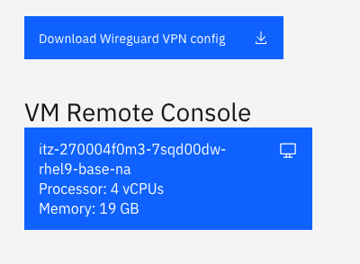
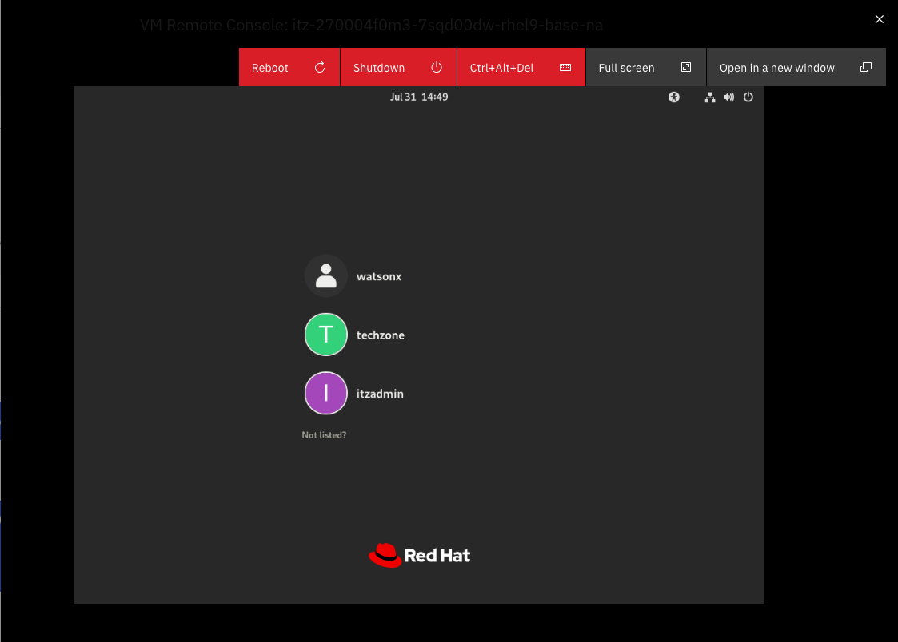
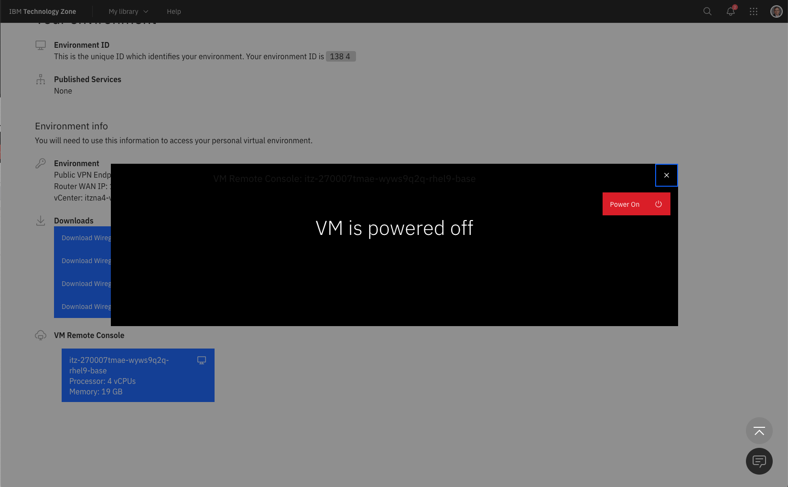
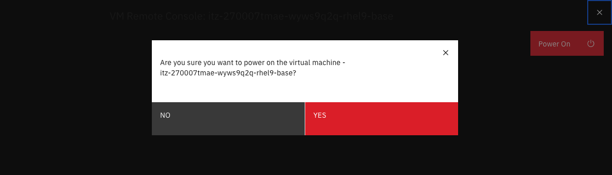

# Troubleshooting watsonx.data

Although we have tried to make the lab as error-free as possible, occasionally things will go wrong. Here is a list of common questions, problems, and potential solutions.

   * [What are the passwords for the serviers](#what-are-the-passwords-for-the-services)
   * [I Can't Open up a Terminal Window with VNC or Guacamole](#i-cant-open-up-a-terminal-window-with-vnc-or-guacamole)
   * [A SQL Statement failed but there are no error messages](#a-sql-statement-failed-but-there-are-no-error-messages)
   * [Apache Superset isn't Starting](#apache-superset-isnt-starting)
   * [Apache Superset screens differ from the lab](#apache-superset-screens-differ-from-the-lab)
   * [My VPN doesn't work](#my-vpn-doesnt-work)
   * [I am unable to use VPN](#i-am-unable-to-use-a-vpn)
   * [Too many incorrect logins using VNC and now I'm blocked](#too-many-incorrect-logins-using-vnc-and-now-im-blocked-from-connecting)
   * [Presto doesn't appear to be working](#presto-doesnt-appear-to-be-working)
   * [Displaying Db2 Schema is failing](#displaying-db2-schema-is-failing)
   * [Queries are failing with a 400 code](#queries-are-failing-with-a-400-code)
   * [Queries are failing with a 500 code](#queries-are-failing-with-a-500-code)
   * [Queries are failing with memory errors](#queries-fail-become-of-insufficient-memory)
   * [SSH, VNC and watsonx.data UI are not working](#ssh-vnc-and-watsonxdata-ui-are-not-working)
   * [Wireguard not starting](#wireguard-not-starting)
   * [No access to Presto/Minio UI after restart](#no-access-to-prestominio-ui-after-restart)
   * [Firefox and Chrome freeze when connecting to MinIO](#firefox-and-chrome-freeze-when-connecting-to-minio)

### What are the passwords for the services?

See the section on [Passwords](wxd-reference-passwords#passwords).

You can get all passwords for the system when you are logged in as the <code style="color:blue;font-size:medium;">watsonx</code> user by using the following command.
```
passwords
```

If you are logged in as the root user, the syntax is slightly different:
```
SSH_TTY=true SSH_CLIENT=true passwords
```

### I Can't Open up a Terminal Window with VNC or Guacamole

First thing to remember is that you can't use VNC and the TechZone VM Remote Console (Guacamole) interface at the same time. Only one can be active at a time. 

#### If you can't use terminal windows in VNC

If you find that the terminal icons "spins" inside the VNC window, this is caused by attempting to connect to the virtual machine by using the VM Remote Console button in your reservation details screen. To fix this problem, you must log out of the VNC session (top right corner of the Linux desktop - press the power button and choose logout). Once VNC logs back in you will be able use the terminal window.

#### If you really want to use the Techzone VM Remote Console

If you start with VNC, you need to fully shut it down if you want to switch to the TechZone Guacamole version. 

Commands to stop the VNC service are:

```
ssh watsonx@192.168.252.2
sudo su -
```

Once you have become root, issue the following commands:
```
systemctl stop vncserver@:1
systemctl disable vncserver@:1
```

Now you can close the VNC window and use the Techzone Remote Console interface.

### A SQL Statement failed, but there are no error messages

You need to use the Presto console <a href="http://192.168.252.2:8080" target="presto">http://192.168.252.2:8080</a> and search for the SQL statement. Click on the Query ID to find more details of the statement execution and scroll to the bottom of the web page to see any error details. 

### Apache Superset isn't Starting

If Superset doesn't start for some reason, you will need to reset it completely to try it again. First make sure you are connected as the `watsonx` user **not** `root`.

Make sure you have stopped the terminal session that is running Apache Superset. Next remove the Apache Superset directory.

```
sudo rm -rf /home/watsonx/superset
```

We remove the docker images associated with Apache Superset. If no containers or volumes exist you will get an error message.

```
docker ps -a -q --filter "name=superset" | xargs docker container rm --force
docker volume list -q  --filter "name=superset" | xargs docker volume rm --force
```

Download the superset code again.

```
git clone https://github.com/apache/superset.git
```

The `docker-compose-non-dev.yml` file needs to be updated so that Apache Superset can access the same network that watsonx.data is using. 

```
cd ./superset
cp docker-compose-non-dev.yml docker-compose-non-dev-backup.yml

sed '/version: "3.7"/q' docker-compose-non-dev.yml > yamlfix.txt
cat <<EOF >> yamlfix.txt
networks:
  default:
    external: True
    name: ibm-lh-network
EOF
sed -e '1,/version: "3.7"/ d' docker-compose-non-dev.yml  >> yamlfix.txt
```

We update the Apache Superset code to version `2.1.0`.
```
sed 's/\${TAG:-latest-dev}/2.1.0/' yamlfix.txt > docker-compose-non-dev.yml
```

Use docker-compose to start Apache Superset.
```
nohup docker compose -f docker-compose-non-dev.yml up &
```

The `nohup` command will issue a message indicating that output will be directed to the `nohup.out` file. It takes some time for the service to start, so be patient! You can view any output from the Apache Superset system by viewing the `nohup.out` file in the directory where you installed superset.

### Apache Superset screens differ from the lab

The Apache Superset project makes frequent changes to the types of charts that are available. In some cases they remove or merge charts. Since these charts changes are dynamic, we are not able to guarantee that our examples will look the same as what you might have on your system.

### My VPN doesn't work

If you downloaded a VPN certificate, and it doesn't appear to work, locate the file on your file system and attempt to view it. If the contents of the file contains the word `disabled`, this indicates that you did not request the VPN certificate to be enabled. You will need to request another image in order to connect with VPN. The other option is to use the Virtual console (guacamole) provided with the reservation. This requires that all exercises in this lab be done in that machine environment.

### I am unable to use a VPN

If you are blocked from using a VPN tunnel, you must use the guacamole interface provided in the reservation details (VM Remote Console). In this case, all URLs will need to be accessed using the Firefox browser that is in the image. Cut-and-paste only works inside the virtual machine so you must use the lab documentation inside the virtual machine.



Once you click on the VM Remote Console button, the login screen for the image will be shown. Do not log into the `watsonx` userid yet!



You will not be able to log on as `watsonx` due to the VNC service that is currently running in the machine. If you try to login you will lock up the screen! If this happens you should reboot the server. 

Once you have the login screen, select `Techzone` from the list of users. Enter `IBMDem0s!` as the password. Once you have gained access to the system, click on Activities at the top of the screen and search for Terminal. Once a terminal screen has opened, issue the following instructions.

```
sudo su -
```
No password should be required.

```
systemctl stop vncserver@:1
systemctl disable vncserver@:1
exit
```

Log out of the Techzone userid and log into the `watsonx` user. At this point you can run the lab using this environment. Note that all URLs will continue to work in this image with IP addresses of `192.168.252.2`.

### Presto doesn't appear to be working

If you find that the watsonx.data UI is generating error messages that suggest that queries are not running, or that the Presto service is dead, you can force a soft restart of Presto with the following command:

```
docker restart ibm-lh-presto
```

This will restart the Presto server. If you find that does not fix your problem, you will need to do a hard reset using the following commands:

```
sudo su -
cd /root/ibm-lh-dev/bin
./stop_service ibm-lh-presto
./start_service ibm-lh-presto
check_presto
```
The command will wait until the service is running before exiting.

### Displaying Db2 Schema is failing

Occasionally when attempting to expand the Db2 catalog (schema), the watsonx.data UI will not display any data or issue an error message. You can try refreshing the browser (not the refresh icon inside the UI) and try again. If you find that this is failing again, open the Query workspace and run the following SQL (replace db2_gosales with the name you cataloged the database with).

```
select count(*) from db2_gosales.gosalesdw.go_org_dim 
```

The result should be `123` and hopefully the tables that are part of the schema will display for you. 

### Db2 is not allowing connections after a system restart

If for reason you have stopped and restarted the server, the Db2 service may not refresh or allow for connections from the watsonx.data UI. This is caused by a setting in the Db2 container environment that attempts to rebuild the instance after a failure. The instance information is stored on a volume outside the container, so this step does not need to be performed. To enable Db2 to restart properly, run the following commands from the root user in the machine.

```
sed -i 's/PERSISTENT_HOME=false/PERSISTENT_HOME=true/' /Docker/.env_list
docker restart db2server
```

### Queries are failing with a 400 code

The watsonx.data UI will log you out after a period of inactivity, but doesn't tell you that this has happened. When you attempt to run a query, the error that is returned (400) indicates that you need to log back in again.

### Queries are failing with a 500 code

A 500 code may indicate the watsonx.data UI has a problem connecting with the Presto engine. First log out of the console and trying logging back on. If that fails to solve the problem, you will need to reboot the console. Open up a terminal window into the server:

```
ssh watsonx@192.168.252.2
```

Then restart the docker container that is running the watsonx.data UI.

```
docker restart lhconsole-nodeclient-svc
```

### Queries fail become of insufficient memory

If you are running a complex query, you may get an error message similar to "Query exceeded per-node user memory limit" or a something similar. Watsonx.data (Presto) attempts to limit the amount of resources being using in a query and will stop a query if it exceeds a certain threshold. 

You can change the behavior of the system by making the following changes. **Note**: During this step you will disconnect anyone running a query on the server.

What you need to do is make a change to the configuration settings of the Presto engine. First, ssh into watsonx:
```
ssh watsonx@192.168.252.2
password=watsonx.data
```

Then enter the docker container for the presto engine:
```
docker exec -it ibm-lh-presto /bin/bash
```

Next, copy the original config file to a safe place in case we make an error:
```
cp /opt/presto/etc/config.properties /opt/presto/etc/config.properties.backup
```

Then update the properties file.
```
cat >> /opt/presto/etc/config.properties << EOL
experimental.spiller-spill-path=/tmp
experimental.spiller-max-used-space-threshold=0.7
experimental.max-spill-per-node=10GB
experimental.query-max-spill-per-node=10GB
experimental.spill-enabled=true
query.max-memory=10GB
query.max-memory-per-node=10GB
query.max-total-memory-per-node=10GB
query.max-total-memory=10GB
EOL
```
Doublecheck that it worked.
```
cat /opt/presto/etc/config.properties | grep experimental
```
<pre style="font-size: small; color: darkgreen; overflow: auto">
experimental.max-spill-per-node=10GB
experimental.query-max-spill-per-node=10GB
experimental.spill-enabled=true
experimental.spiller-max-used-space-threshold=0.7
experimental.spiller-spill-path=/tmp
</pre>

If it is all good then exit the container.
```
exit
```
And now we restart the container. Make sure that you don't impact other users!
```
docker restart ibm-lh-presto
```
Now try running your query again. 

**Note**: Once you make this change, only restart presto using the above command, otherwise you will lose the changes.

### Too many incorrect logins using VNC and now I'm blocked from connecting

If you lock yourself out of VNC because of too many incorrect logins, you can reset the service with the following commands.

Connect as the root user.
```
ssh watsonx@192.168.252.2
sudo su -
```

Then run the following command and you should be able to log in again.
```
systemctl restart vncserver@:1
exit
```

### SSH, VNC and watsonx.data UI are not working

Symptoms:

* You've tried to use SSH to log into the system and you get a timeout error.
* All the Web-based UIs (watsonx.data UI, Presto) fail.
* VNC gets a connection error.

The first thing to check is to make sure your VPN is activated, Assuming you have already done that, here is what you need to do.

Find your email message that contains details of your reservation. Details of what the reservations and the page containing details of the reservation can be found in the [Accessing the reservation](wxd-reference-access.md) section. 

Once the details appear, scroll down to the bottom of the web page, and you will see the VM Remote Console button along with the VPN certificates.


You can access the logon screen of the virtual machine by pressing the VM Remote Console button. 


Clicking on this button will display the logon screen for the server.


If you see this screen, the system is running and there is something wrong with your VPN certificate or your laptop is not connecting through the VPN. You will need to post a message in the watsonx.data support channel and ask for help.

If you see the following screen:



This means your server has been turned off. Click on the Power on button.



Make sure to press the Yes button to turn the power on! In a few minutes you should see the logon screen again.


Wait for a few minutes for all the services to start, and then you will be able to use SSH, VNC, and watsonx.data UI. Don't use this interface to work with watsonx.data unless you cannot install VPN software (i.e., your machine is locked down).

### Wireguard Not Starting

On the Mac, the Wireguard application will not always display in the Dock. If it doesn't appear to "start", it may be sitting in the Systray at the bottom or top of your screen. The icon will be gray if no connections are active.

 

### No access to Presto/Minio UI after restart

If you are using a Techzone image that has been suspended, or restarted, you may come across a situation where you are unable to connect to any service that uses the `http` protocol. The `watsonx.service` needs to have a diagnostic flag set that opens up these ports, and sometimes this diagnostic setting is not being updated. 

To manually stop and start the system, you will need to connect with root user privileges and run the following commands:

```
sudo su -
cd /root/ibm-lh-dev/bin
./stop.sh
export LH_RUN_MODE=diag
./start.sh 
```

This set of commands will stop all the services in watsonx.data and restart them in diagnostic mode. This will now open the `http` ports for use.

### Firefox and Chrome freeze when connecting to MinIO

Firefox and Chrome on OSX will occasionally freeze when connecting to the MinIO console. The Safari browser is much more reliable. This problem appears to be caused by some features which are not properly handled by these browsers. 

