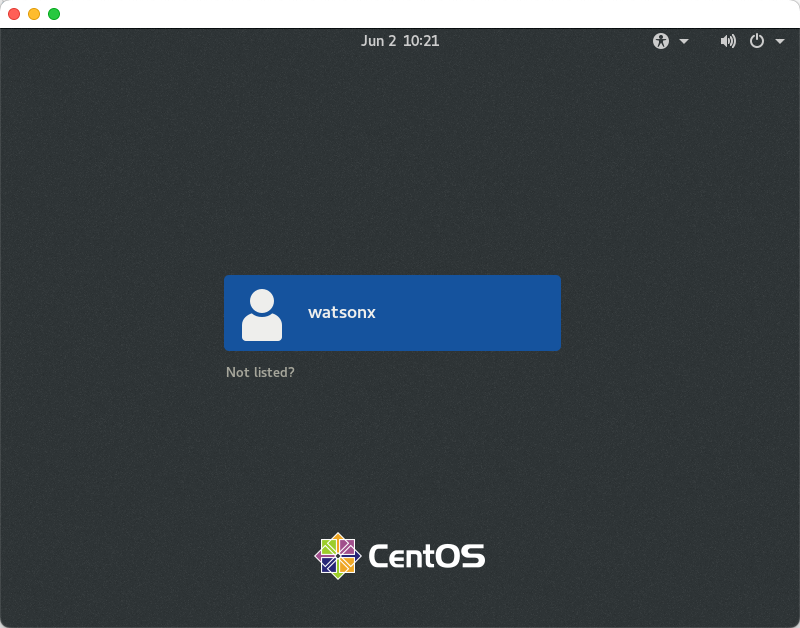
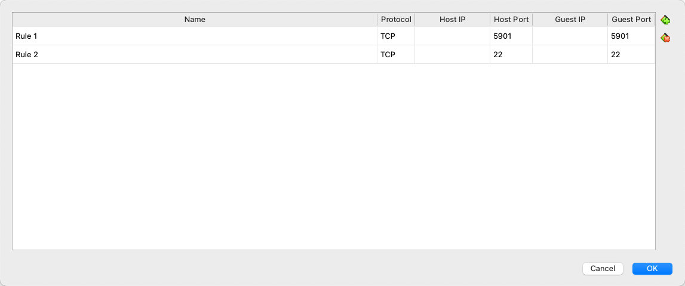

# IBM watsonx.data VMware Image

The IBM watsonx.data lab can be run in a virtual machine environment using VMWare Workstation, VMWare Fusion, or Oracle VirtualBox. The location of the OVA file (a compressed OS image format) is provided in the TechZone page for the lab:

[https://techzone.ibm.com/collection/ibm-watsonxdata-developer-base-image](https://techzone.ibm.com/collection/ibm-watsonxdata-developer-base-image)

Select the resources tab to get details on how to download the file.


Download the <mark>watsonxdata.ova</mark> file onto your local machine and then use the import function of VMware or VirtualBox to register it with the system. 

**Note**:  this virtual machine was created using X64 (Intel) hardware so this may not work in an OSX environment using M1/M2 chips. Once the machine is imported you can delete the OVA file.

Before starting the machine, you may want to adjust the hardware requirements.

   * vCPUs – 4 VPCs minimum
   * Memory – 12Gb minimum
   * Disk – 30Gb initial size, but the image will grow in size
   * Disable side channel mitigation ON (VMware only)

### VMware URLs 
All of the URLs in the lab will be using <mark>localhost</mark> as the server and the following ports:

   * <mark>9443</mark> - IBM watsonx.data management console
   * <mark>8080</mark> - Presto console
   * <mark>9001</mark> - MinIO console (S3 buckets)
   * <mark>6443</mark> - Portainer (Docker container management)
   * <mark>8088</mark> - Apache Superset (Query and Graphing)
   * <mark>5901</mark> - VNC Access (Access to GUI in the machine)
   * <mark>7681</mark> - SSH (Terminal access) via Browser
   * <mark>22</mark> - SSH (Terminal access) via local terminal program
   * <mark>8443</mark> - Presto External Port (dBeaver connection)
   * <mark>5432</mark> - Postgres External Port (dBeaver connection)

The instructions in the lab will refer to a TechZone or VMware URL when asking for you to connect to a service. The following example asks you to connect to the UI.

Open your browser and navigate to:

   * IBM watsonx.data UI - <mark>https://region.techzone-services.com:xxxxx</mark>
   * VMWare Image - <mark>https://localhost:9443/</mark>

The port number (<mark>xxxxx</mark>) will need to match the service found above. The assumption is that you are running inside the VMware image (i.e., using a browser inside the virtual machine).

## Starting the VMware Image

When the machine starts, you will be prompted with the logon screen.


 
There are two userids that we will be using in the VMware image:

   * root – password <mark>watsonx.data</mark>
   * watsonx – password <mark>watsonx.data</mark>

When successfully logged in you should see the following screen.


 
Next, check that your network connection is up and running. You will be able to see if the network is connected when the network icon appears on the top row.


 
If it shows Wired Off, make sure to turn it on by clicking on the arrow and choosing “Connect”.


If you are using something other than an English keyboard, click on the en1 symbol on the top bar to switch to a different layout. If your keyboard is not listed, you will need to go into Settings and add your keyboard layout.


You may also want to consider making the screen size larger. Use the drop-down menu at the top of the screen to select System Tools -> Settings. 


In the Devices section of the Setting menu, select Displays and choose a resolution that is suitable for your environment.
 
## Using External Ports with VMware/Virtual Box
The labs assume that you are using a browser "within" your virtual machine console. However, both VMware and VirtualBox provide a method for accessing the ports on the virtual machine in your local environment. 

### VMware

For VMware, the easiest way to connect to the virtual machine from your host machine is to use the ifconfig command to determine your virtual machine IP address.
```
ifconfig
```


 
Search for an <mark>ensxx**</mark> value in the output from the command. There you should see the inet address of your virtual machine (<mark>172.16.210.237</mark>). To access the Portainer application from your local browser, you would use this address followed by the Portainer PORT number: <mark>https://172.16.210.237:6443</mark>.

Remember that inside your virtual machine, you will be using <mark>https://localhost:6443</mark>. The following PORT numbers are open in the machine:

   * <mark>9443</mark> - IBM watsonx.data management console
   * <mark>8080</mark> - Presto console
   * <mark>9001</mark> - MinIO console (S3 buckets)
   * <mark>6443</mark> - Portainer (Docker container management)
   * <mark>8088</mark> - Apache Superset (Query and Graphing)
   * <mark>5901</mark> - VNC Access (Access to GUI in the machine)
   * <mark>7681</mark> - SSH (Terminal access) via Browser
   * <mark>22</mark> - SSH (Terminal access) via local terminal program
   * <mark>8443</mark> - Presto External Port (dBeaver connection)
   * <mark>5432</mark> - Postgres External Port (dBeaver connection)

### VirtualBox

VirtualBox does not externalize the IP address of the virtual machine. The <mark>ifconfig</mark> command will provide an IP address of the machine but it will not be reachable from your host browser. To open the ports, you must use the network option on the virtual machine. This step can be done while the machine is running. From the VirtualBox console, choose Settings for the machine and then click on the Network option.


 
Press the Advanced option near the bottom of the dialog.


 
Select the Port Forwarding button. This will display the port forwarding menu.


 
You must place an entry for each port that we want to externalize to the host machine. If the value for Host IP is empty (blank), it defaults to localhost. In the example above, the 5901 port in the Guest machine (watsonxdata) is mapped to the host machines 5901 port. To access VNC, you would use <mark>localhost:5901</mark>. If the guest machine port conflicts with the host machine port number, you can use a different port number. 

## Lab URL Considerations
Once you have your virtual machine up and running and the appropriate ports opened (if required), you need to remember that any reference to a web address will need to be changed to localhost:port if running inside your virtual machine, or <mark>IP:port/localhost:port</mark> if you are using a host browser.

## Terminal Command Window

All of the commands in the lab will require you execute commands in a terminal window. In addition, the labs require access to the root userid, and this can be accomplished in two ways that are described below.

### Local Terminal Shell

Use a local terminal shell (iterm, Hyper, terminal) and use the SSH command to shell into the machine. For the VMware image, you need to know the IP address of the image and the port number that has been exposed for SSH command (default is 22). Assuming that your VMware machine has an IP address of <mark>172.16.210.237</mark>, the command to SSH into the machine would be:
```
ssh watsonx@172.16.210.237
```


You will need to accept the unknown host warning and then provide the password for the watsonx userid: <mark>watsonx.data</mark>.

At this point you are connected as the watsonx user. To become the root user, you must enter the following command in the terminal window.
```
sudo su -
```
Now as the root user you will be ready to run the commands found in the lab.

### Terminal Window in Virtual Machine

You can use the Terminal application in the virtual machine to issue commands. 


This will open up the terminal window.


At this point you are connected as the watsonx user. To become the root user, you must enter the following command in the terminal window.
```
sudo su -
```

Now as the root user you will be ready to run the commands found in the lab.