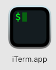
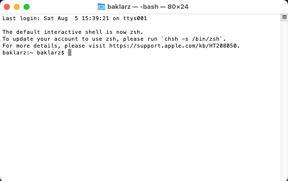
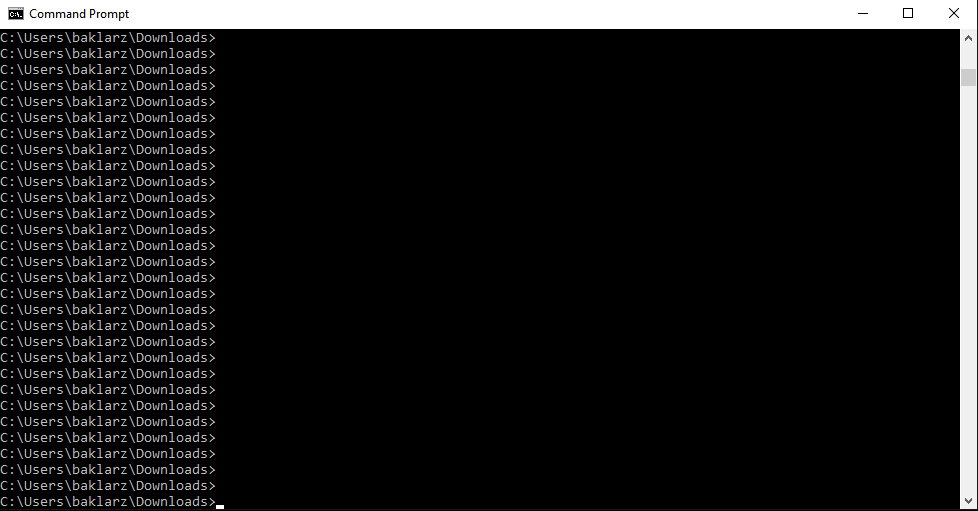

# VNC Usage

VNC provides access to the watsonx.data machine console and allows you to run commands in this environment. But did you know that you don't have to use VNC during the challenge? This thread provides some guidance on the use of VNC and how you can avoid some problems when using a virtual console.

#### VNC isn't needed for any watsonx.data UI features.

You can access all of these servers using the browser on your laptop. Just make sure you have VPN activated on your machine, and then you can start clicking on these links. Don't have Wireguard? See the section on [VPN installation](wxd-reference-wireguard.md) for more details on how to install and use this software. The services that you can access with your browser are:

  * <a href="https://192.168.252.2:9443" target="_blank">https://192.168.252.2:9443</a> - watsonx.data management console
   * <a href="http://192.168.252.2:8080" target="_blank">http://192.168.252.2:8080</a> - Presto console
   * <a href="http://192.168.252.2:9001" target="_blank">http://192.168.252.2:9001</a> - MinIO console (S3 buckets)
   * <a href="https://192.168.252.2:6443" target="_blank">https://192.168.252.2:6443</a> - Portainer (Docker container management)
   * <a href="http://192.168.252.2:8088" target="_blank">http://192.168.252.2:8088</a> - Apache Superset (Query and Graphing)
   * <code style="color:blue;font-size:medium;">ssh watsonx@192.168.252.2</code> Shell into the watsonx.data machine
   
Please note that Apache Superset is not started in the system. You need your team lead to start it using the instructions in the [Apache Superset](wxd-superset.md) section.

#### SSH Usage

The `ssh` command is used to get "into" the watsonx.data machine. This provides a way, without a desktop, to run commands in the server. The following command allows you to connect:
```
ssh watsonx@192.168.252.2
password=watsonx.data
```

This is a good way to check if your system is working. If it comes back and asks for your password, you know that your VPN is working and you can start issuing commands in the server.

So where do you enter the above command? Open up a terminal window on the Mac using the iTerm program (or similar) by clicking on the icon:



You should see the terminal window appear.



On Windows, use the CMD or PowerShell window. 



This is where you should be issuing your commands. 

**Caution**: What you do in the ssh environment will impact **all** users on the system. When you are done using the shell, use the `exit` command and do not `logout`. You will cause everyone to disconnect from the system if they using VNC or another command shell.

<p style="color:red">DO NOT USE SSH INSIDE THE VNC CONSOLE</p>
You are already the watsonx user so using the ssh command is like logging into the machine again. You are already "watsonx" so you can run commands without using ssh. 

Also, don't use a terminal window inside VNC for complex commands. Cut and Paste does not work between a workstation and the VNC console. You need to use a terminal window outside VNC to paste commands.


#### Why do I need VNC?

Perhaps you can't use the VPN or VNC software, so your only alternative is to use the VM Remote Console. Other than that, you only need to use VNC if you want to use the dBeaver program which is installed in the system. dBeaver is a query tool and can be used to look at the data in the watsonx.data system. However, you can do the same thing with the watsonx.data UI or with Apache Superset.

If you are unable to install any VPN or VNC software, please see the section on [Using the VM Remote Console](wxd-troubleshooting.md#i-am-unable-to-use-a-vpn).

#### What is the VNC URL, Port and Password?

Whatever VNC software you are using, the IP address is `192.168.252.2:5901`. The password for Mac OSX users is `watsonx.data` and for those on Windows it is `watsonx.`. That is `watsonx` with a period `.` after it. This password is only meant to be used for connecting with the VNC software. Once you connect to the desktop you will need to use the watsonx userid's password `watsonx.data`.

Need to install the VNC software? See the section on [Installing a VNC client](wxd-reference-vnc.md).

#### Multiple VNC Users?

You can have multiple people using the console at one time. However, you may find there are some side effects! You are all working on the same console (desktop) at the same time which means anything you do will be seen by everyone else that is connected. You can probably cause your team-mate to get frustrated when you move the cursor on them while they are typing a command. For this reason, you should co-ordinate the use of VNC among the team members, if you really need to use it.

Best practice is to leave the access of VNC to the team lead and have them decide whether anyone really needs to use this interface. As you see above, everything you need to do can be done through the direct links above.

#### What should I do when I'm finished with the console?

Don't shut down. Whatever you do, do not turn off the machine or else you will need to get the team-lead to restart it using [Restarting a machine](wxd-troubleshooting.md#ssh-vnc-and-watsonxdata-ui-are-not-working). Close your VNC program and just leave your screen the way it is. Your team-mates will appreciate it.

#### VNC is sluggish or doesn't seem to work.

You might see the logon screen and enter the password and find nothing happens. This could be due to too many users trying to connect, or the VNC connection is just being difficult on you. Use the following technique: Try clicking your right mouse button on the screen and hold the button while you swipe "up". See if the screen refreshes.

If you really can't get VNC working, then please go through these steps before posting anything in the channel.

Is your VPN active? <code style="color:green;font-size:medium;">Yes</code> or <code style="color:red;font-size:medium;">No</code>. 

* <code style="color:red;font-size:medium;">No</code> - Turn it on and start again

Can you run the following command in a terminal window on your laptop and can you connect to watsonx? <code style="color:green;font-size:medium;">Yes</code> or <code style="color:red;font-size:medium;">No</code>. 
``` 
ssh watsonx@192.168.252.2
password=watsonx.data
```
* <code style="color:red;font-size:medium;">No</code> - Your system has been shut down. Get the team lead to restart the server using the instructions found at [Restarting your system](wxd-troubleshooting#ssh-vnc-and-watsonxdata-ui-are-not-working)
* <code style="color:green;font-size:medium;">Yes</code> - Your VNC is sick. You can reset the VNC using the following command in a terminal window.
```
ssh watsonx@192.168.252.2
password=watsonx.data
```
And then run:
```
sudo systemctl restart vncserver@:1
exit
```

#### My watsonx.data UI isn't responsive or doesn't seem to work

One of two things can happen that will make the watsonx.data UI generate random error messages when you run a command or SQL.

If you see a `400` series error, this is usually because the watsonx.data UI logged you out because your were idle for too long. You can fix this by refreshing your screen and logging back in again.

If you see a `500` series error, or commands or utilities in the UI appear to fail, or work differently than a previous day, it's probably because there has been some failure in the code. To fix this problem, use the following command. Before continuing, check with other team-mates to see if they are having similar issues.

Open a terminal window and shell into the watsonx userid.
```
ssh watsonx@192.168.252.2
password=watsonx.data
```
And then run:
```
docker restart lhconsole-nodeclient-svc
exit
```

Wait for a few minutes and try again. If that doesn't work then you will need to post your error in the slack channel.

#### Other Issues?

If you find you are having a problem with the system, please look at the [Troubleshooting](wxd-troubleshooting.md) section for more help.