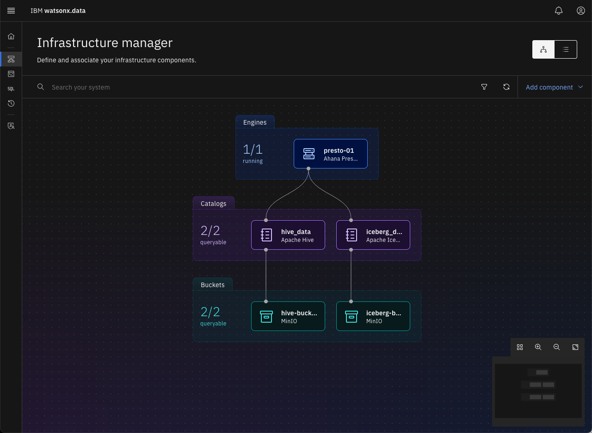
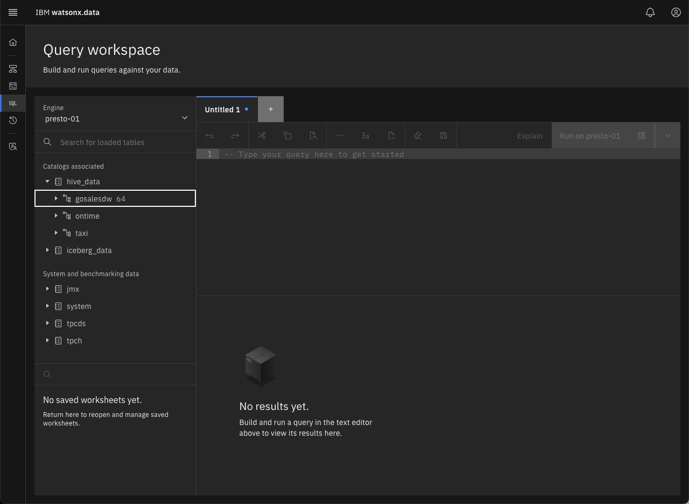
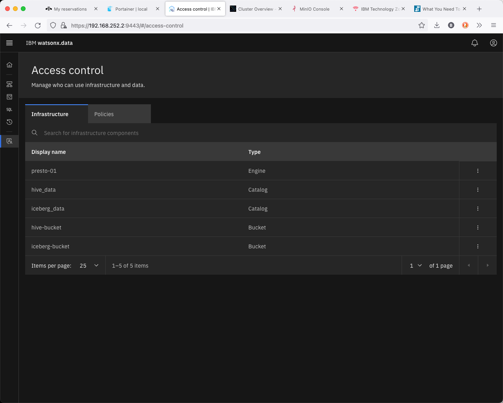

# Using the IBM watsonx.data console UI
Open your browser and navigate to:

   * IBM watsonx.data UI - https://ussouth.techzone-services.com:xxxxx
   * VMWare Image - https://localhost:9443/
   * Credentials: username: <mark>ibmlhadmin</mark> password: <mark>password</mark>

Note: You will get a Certificate error in Firefox:

 
Select Advanced.

 
Choose “Accept the Risk and Continue”. If you are using Google Chrome, you can bypass the error message by typing in “thisisunsafe”. 
  
  

The userid is <mark>ibmlhadmin</mark> with password of <mark>password</mark>.

**Note**: If you see the following screen when first connecting to the UI, this is an indication that the service has not completely initialized.

 
Dismiss all the error messages and then click on the Person icon (far right side above the messages) and Logout. Close the browser window after logging out and open the web page again until you get the proper login screen. At this point you will be connected to the console.

**Note**: With the IBM watsonx.data Developer version everything is already pre-provisioned as part of the system start up. Console UI is still under construction, but you will be able to navigate the different screens and experience it.

## IBM watsonx.data UI Navigation

The main screen provides a snapshot of the objects that are currently found in the IBM watsonx.data system. The infrastructure components shows that there is 1 engine, 2 catalogs and 2 buckets associated with the system.

 

You can examine these objects by using the menu system found at the left side of the screen. Click on the hamburger icon.

This will provide a list of items that you can explore in the UI.

You can also access this list by clicking on one of the following icons.

    

You can explore the various menus to see how the UI works. A brief description of the items is found below.

* Infrastructure manager - Displays the current engines, buckets and databases associated with the installation.

 

* Ingestion Hub - Used for loading data into the system (currently not enabled).
* Data Explorer - Used to explore the various data sources that are catalogued in the system. You can explore the schemas, tables, table layout and view a subset of the data with this option.

 

* Query Workplace - A SQL-based query tool for accessing the data.

 

* Query History - A list of SQL queries that were previously run across all engines.

 

* Access Control - Control who can access the data.

 

* Billing and Usage - Information on the usage of the system (currently not enabled).

Try using the Data Explorer and Query engine to access some of the data in the pre-defined TPCH schema.