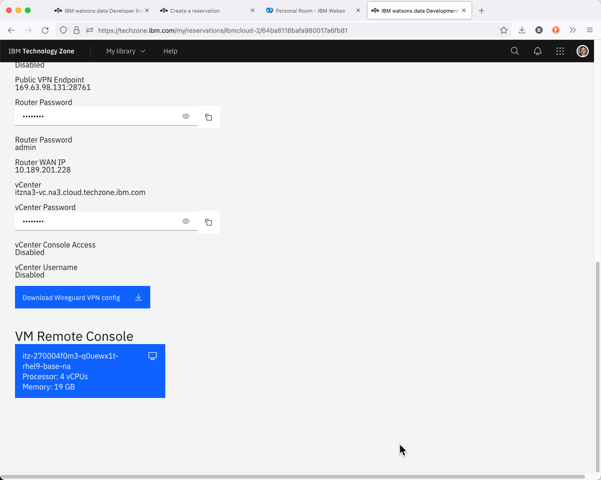

# Wireguard VPN Access

## Download the VPN Certificate

If you have not already downloaded the VPN certificate, follow these steps. 

Access your reservation from the TechZone site. Click on the arrows that corresponds to the watsonx.data reservation. The menu button that is beside the arrow provides options to extend or delete the reservation.

When you click on the arrow the browser will display the details of your image.

Scroll down to the bottom of the web page to get the VPN certificate.

Click the Download VPN certificate to your machine and remember the filename for later use.

Once you have the VPN downloaded, you must start the Wireguard VPN client. If you do not have this software on your system, download the software from the following site.

https://www.wireguard.com/install/

Once installed, you will use the software to load the VPN certificate.

The following sections describe how to get started quickly with the watsonx.data developer system. If you are not familiar with some of the tools mentioned below, select the details link for more instructions.

## Requesting a TechZone image

Log into Techzone (https://techzone.ibm.com) and search for watsonx.data
Developer Base Image or use the following link.

[https://techzone.ibm.com/collection/ibm-watsonxdata-developer-base-image](https://techzone.ibm.com/collection/ibm-watsonxdata-developer-base-image)

Make sure to **enable VPN access** in the reservation. 

More details: [Reserving a TechZone image](wxd-reference-techzone.md)

## Accessing the Image

The email from TechZone that indicate that the image is ready will contain a link to to your reservations. Click on the link and search for the watsonx.data reservation. Make sure the download the VPN certificate onto your machine. **Do not use the VM Remote Console button on the reservation.**

More details: [Accessing a TechZone image](wxd-reference-access.md)

## Wireguard Setup

Install Wireguard (or similar utility) that allows a VPN certificate to be imported and used to access the virtual machine. Import the certificate that was downloaded in the previous step and enable the connection.

More details: [Wireguard Setup](wxd-reference-wireguard.md)

## VNC Access

Once the Wireguard VPN service is enabled, you can access the machine console using the following IP address: 192.168.252.2:5901. For Mac OSX users, place the following value into the Safari browser to access the console: <code style="color:blue;font-size:medium;">vnc://192.168.252.2:5901</code>.

The password for the VNC connection is <code style="color:blue;font-size:medium;">watsonx.data</code>

## Open Ports

The following URLs and Ports are used to access the watsonx.data services.
The ports that are used in the lab are listed below.

   * <a href="https://192.168.252.2:9443" target="_blank">https://192.168.252.2:9443</a> - watsonx.data management console
   * <a href="http://192.168.252.2:8080" target="_blank">http://192.168.252.2:8080</a> - Presto console
   * <a href="http://192.168.252.2:9001" target="_blank">http://192.168.252.2:9001</a> - MinIO console (S3 buckets)
   * <a href="https://192.168.252.2:6443" target="_blank">https://192.168.252.2:6443</a> - Portainer (Docker container management)
   * <a href="http://192.168.252.2:8088" target="_blank">https://192.168.252.2:8088</a> - Apache Superset (Query and Graphing)
   * vnc://192.168.252.2:5901 - VNC Access (Access to GUI in the machine)
   * 8443 - Presto External Port
   * 5432 - Postgres External Port
   * 50000 - Db2 Database Port   

**The Apache Superset link will not be active until started as part of the lab.**

More details: [Open Ports](wxd-reference-ports.md)

## Passwords

This table lists the passwords for the services that have "fixed" userids and passwords.

|Service|Userid|Password
|-------|------|--------|
|Virtual Machine|watsonx|watsonx.data
|Virtual Machine|root|watsonx.data
|watsonx.data UI|ibmlhadmin|password
|Presto|None|None
|Minio|Generated|Generated
|Postgres|admin|Generated
|Apache Superset|admin|admin
|Portainer|admin|watsonx.data
|Db2|db2inst1|db2inst1

Use the following commands to get the generated userid and password for MinIO.
<code class="language-bash"><pre>
export LH_S3_ACCESS_KEY=$(docker exec ibm-lh-presto printenv | grep LH_S3_ACCESS_KEY | sed 's/.*=//')
export LH_S3_SECRET_KEY=$(docker exec ibm-lh-presto printenv | grep LH_S3_SECRET_KEY | sed 's/.*=//')
echo "MinIO Userid  : " $LH_S3_ACCESS_KEY
echo "MinIO Password: " $LH_S3_SECRET_KEY
</pre></code>

Use the following command to get the password for Postgres.
<code class="language-bash"><pre>
export POSTGRES_PASSWORD=$(docker exec ibm-lh-postgres printenv | grep POSTGRES_PASSWORD | sed 's/.*=//')
echo "Postgres Userid   : admin"
echo "Postgres Password : " $POSTGRES_PASSWORD
</pre></code>

If you have a terminal window open you can use the command <code>passwords</code> command to retrieve all of the passwords.

**Note**: You cannot cut and paste a value into a VNC screen.