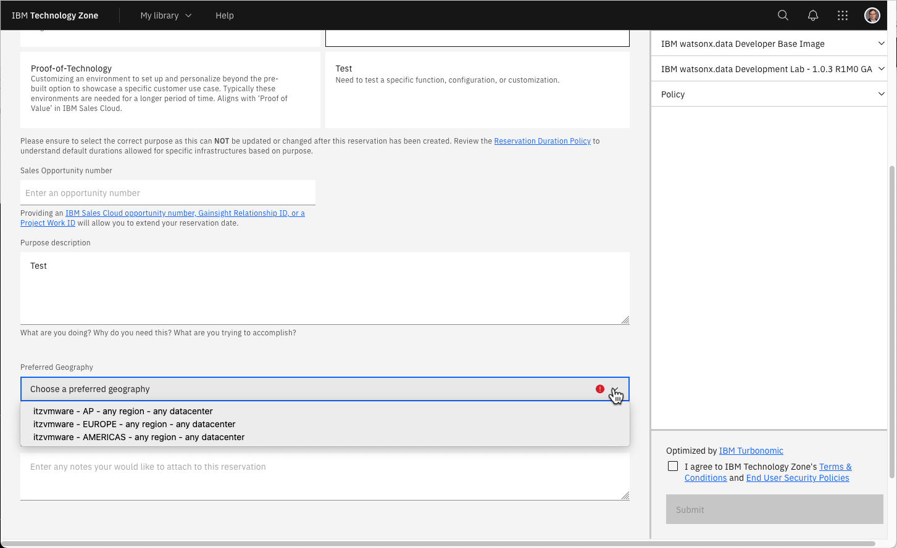
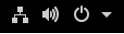
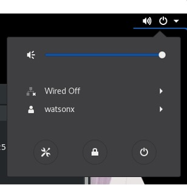

# Lab Setup

There are two methods for running the IBM watsonx.data development system. One is to use an image on TechZone and the second is to run a virtual machine on your laptop. The first section will describe the steps involved in using a TechZone image, while the next section will explain how to use a supplied VMWare image. If you choose to use a local image, skip to the section called VMWare Lab Image.

### Requesting a TechZone image
Log into Techzone (https://techzone.ibm.com) and search for IBM watsonx.data
Developer Base Image or use the following link.

https://techzone.ibm.com/collection/ibm-watsonxdata-developer-base-image

If you have not logged into the IBM Cloud site, you will be asked to
authenticate with your IBM userid. If you do not have an IBM userid, you will
need to register for one. This lab is open to IBMers and Business Partners. Once
you have logged in, you should see the following.


 
Select the Environment tab on the far-left side.


 
Press the Reserve button.


 
Select “reserve now” (why wait?).


 
For “Purpose” select Self Education. This will expand to request additional information.


 
Make sure to check "Not to be used with customer data".


 
Fill in the purpose field with something meaningful (IBM watsonx.data
education). Next select preferred Geography for the image.


Choose any of the regions that are closest to your location. For the Americas,
choose DAL10, but WDC04 can also be used if you find reservations are failing on
the Dallas datacenter. Next select the end date for the lab.


Make sure you select enough time for you to use the lab! It defaults to 2 days,
but you can extend the reservation! You do not need to enable VPN Access. Once
you have completed the form, click SUBMIT in the bottom right-hand corner.


At this point you will need to wait patiently for the request to be placed into
Provisioning mode.


Eventually you will receive the message that the system is now Ready. Of course,
you may also get a message telling you that the system provisioning has Failed.
I would suggest trying again. If DAL10 fails, try WDC04. 

The reservation email
from TechZone is extremely important since it lists all the ports that we will
be using to access the lab. Details on what these ports are used for are
described in the next section. 

**Note**: Only the URLs for VNC, SSH, Browser SSH,
and Portainer are live until you start IBM watsonx.data in the server. Only the
links listed above will work! Do NOT worry about broken URLs until you have the
server up and running! 


 
### TechZone and VMware URLs 
The TechZone reservation note provides URLs to the services that you will
accessing in IBM watsonx.data. These URLs provide access to:

   * 9443 - IBM watsonx.data management console
   * 8080 - Presto console
   * 9001 - MinIO console (S3 buckets)
   * 6443 - Portainer (Docker container management)
   * 8088 - Apache Superset (Query and Graphing)
   * 5901 - VNC Access (Access to GUI in the machine)
   * 7681 - SSH (Terminal access) via Browser
   * 22 - SSH (Terminal access) via local terminal program
   * 8443 - Presto External Port (dBeaver connection)
   * 5432 - Postgres External Port (dBeaver connection)

Each of these services will have a URL and a specific port number assigned to it. The default port number when running inside the virtual machine is listed in blue. These are not the port numbers that you will use to access these services. The port numbers have been randomly set to different values for the TechZone image. For instance, a TechZone reservation might have a URL for the IBM watsonx.data console listed as "IBM watsonx.data UI - https://ussouth.techzone-services.com:42909". Enter this URL into your local browser to access the console. The instructions in the lab will refer to this TechZone reservation document when asking for you to connect to a service. The following example asks you to connect to the UI.

Open your browser and navigate to:

   * IBM watsonx.data UI - https://ussouth.techzone-services.com:xxxxx
   * VMWare Image - https://localhost:9443/

The port number (xxxxx) will need to be updated based on your TechZone reservation document URL. 

For those students that are using a VMware image, the real port number is shown in the instructions and referenced as localhost. The assumption is that you are running inside the VMware image (i.e., using a browser inside the virtual machine).

## VMware/Virtual Box Lab Image

The IBM watsonx.data lab can be run in a virtual machine environment using VMWare Workstation, VMWare Fusion, or Oracle VirtualBox. The location of the OVA file (a compressed OS image format) will be provided as part of the lab.

Download the watsonxdata.ova file onto your local machine and then use the import function of VMware or VirtualBox to register it with the system. Note this virtual machine was created using X64 (Intel) hardware so this may not work in an OSX environment using M1/M2 chips. Once the machine is imported you can delete the OVA file.

Before starting the machine, you may want to adjust the hardware requirements.

   * vCPUs – 4 VPCs minimum
   * Memory – 12Gb minimum
   * Disk – 30Gb initial size, but the image will grow
   * Disable side channel mitigation ON (VMware only)

When the machine starts, you will be prompted with the logon screen.


 
There are two userids that we will be using in the VMware image:

   * root – password <mark>watsonx.data</mark>
   * watsonx – password <mark>watsonx.data</mark>

When successfully logged in you should see the following screen.


 
Next, check that your network connection is up and running. You will be able to see if the network is connected when the network icon appears on the top row.


 
If it shows Wired Off, make sure to turn it on by clicking on the arrow and choosing “Connect”.



If you are using something other than an English keyboard, click on the en1 symbol on the top bar to switch to a different layout. If your keyboard is not listed, you will need to go into Settings and add your keyboard layout.


You may also want to consider making the screen size larger. Use the drop-down menu at the top of the screen to select System Tools -> Settings. 


In the Devices section of the Setting menu, select Displays and choose a resolution that is suitable for your environment.
 
### Using External Ports with VMware/Virtual Box
The labs assume that you are using a browser "within" your virtual machine console. However, both VMware and Virtual Box provide a method for accessing the ports on the virtual machine in your local environment. 

### VMware

For VMware, the easiest way to connect to the virtual machine from your host machine is to use the ifconfig command to determine your virtual machine IP address.
```
ifconfig
```


 
Search for an <mark>ensxx**</mark> value in the output from the command. There you should see the inet address of your virtual machine (<mark>172.16.210.237</mark>). To access the Portainer application from your local browser, you would use this address followed by the Portainer PORT number: <mark>https://172.16.210.237:6443</mark>.

Remember that inside your virtual machine, you will be using <mark>https://localhost:6443</mark>. The following PORT numbers are open in the machine:

   * IBM watsonx.data UI: 9443
   * Presto Console: 8080
   * Portainer: 6443
   * MinIO Object Store: 9001
   * Apache Superset: 8088
   * System SSH: 22

### Virtual Box

VirtualBox does not externalize the IP address of the virtual machine. The ifconfig command will provide an IP address of the machine but it will not be reachable from your host browser. To open the ports, you must use the network option on the virtual machine. This step can be done while the machine is running. From the VirtualBox console, choose Settings for the machine and the click on the Network option.


 
Press the Advanced option near the bottom of the dialog (next page).


 
Select the Port Forwarding button. This will display the port forwarding menu.


 
You must place an entry for each port that we want to externalize to the host machine. If the value for Host IP is empty (blank), it defaults to localhost. In the example above, the 5901 port in the Guest machine (watsonxdata) is mapped to the host machines 5901 port. To access VNC, you would use <mark>localhost:5901</mark>. If the guest machine port conflicts with the host machine port number, you can use a different port number. 

## Lab Considerations
Once you have your virtual machine up and running and the appropriate ports opened (if required), you need to remember these things while running the labs:

   * Any reference to a web address will need to be changed to localhost:port if running inside your virtual machine, or <mark>IP:port/localhost:port</mark> if you are using a host browser.
   * The root user password is <mark>watsonx.data</mark> and the regular user is <mark>watsonx</mark> with <mark>watsonx.data</mark> as the password.
   * IBM watsonx.data, dBeaver, Portainer, and Apache Superset, and IBM tools have been pre-installed.

## Portainer

This lab system has Portainer installed. Open your browser and navigate to:

   * Portainer console - https://ussouth.techzone-services.com:xxxxx
   * VMWare Image - https://localhost:6443/
   * Credentials: userid: <mark>admin</mark> password: <mark>watsonx.data</mark>

Once you have logged in, you should select “Get Started”.


 
The next screen displays the main control panel for Portainer.


 
Select the Local server.


 
This screen provides details on the containers, images, volumes, and networks that make up your docker installation. To view the containers that are running, select the container icon.


 
From within this view, you can view the details of any container, including the environment settings, the current logs, and allow you to shell into the environment. 
For more details on Portainer, see the [Documentation](https://docs.portainer.io/user/home).

## Local Terminal Shell
The labs require access to the root userid, and this can be accomplished in two ways that are described below.

Use a local terminal shell (iterm, Hyper, terminal) and use the SSH command to shell into the machine. The TechZone reservation document provides the command that you need to use to shell into the machine.

   * SSH for watsonx userid - <mark>ssh -p xxxxx watsonx@ussouth.techzone-services.com</mark>

The text in blue would be placed into the terminal window and executed. The password for watsonx is watsonx.data. You will need to say "yes" to the continue connecting prompt.


 
At this point you are connected as the watsonx user. To become the root user, you must enter the following command in the terminal window.
```
sudo su -
```

Now as the root user you will be ready to run the commands found in the lab.

### SSH via Browser
This lab provides a URL to use SSH in a browser window. This is a URL which will open an SSH shell into the machine using the browser instead of having to use a terminal session on your machine.
   
   * Browser SSH - <tt style="color:blue"http://ussouth.techzone-services.com:xxxxx</mark>

Copy the link into a browser window and hit Enter. The browser will prompt you for a userid and password.

 
The userid is watsonx and the password is watsonx.data.
 
Although you logged in as watsonx, you are immediately switched to the root user. There is no need to switch userids. Note that you can open as many SSH browser windows are required. The userid and password prompt will not be repeated after the initial log in.

### VMWare/Virtual Box
If you are running in a local virtual machine, the assumption is that you will use a terminal shell inside the virtual machine to run the commands. Once you have opened a terminal shell, issue the following command to become the root user.
sudo su -

## VNC Access
To access the virtual machine environment in Techzone, a VNC port has been provided for you to use. 

   * VNC for watsonx userid - vnc://ussouth.techzone-services.com:xxxxx

Use the Mac screen sharing app or an equivalent one on Windows to connect to watsonx. You can also connect using the Safari browser by using the address. It will automatically start the screen sharing application.
 
You will need to enter the password for the watsonx user - watsonx.data.
 
Once connected you will see the console of the watsonx user.
 
At this point your image is ready to  start the IBM watsonx.data server.

**Note**: If you find that you can't start a terminal session in the VNC console, you may need to press the power button at the top right-hand corner and log out from the watsonx user. The screen will refresh and log you back in as watsonx. At this point you should be able to start a terminal session.  
