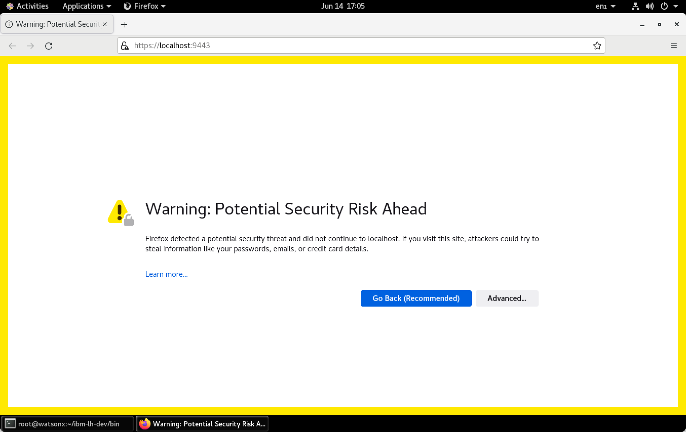
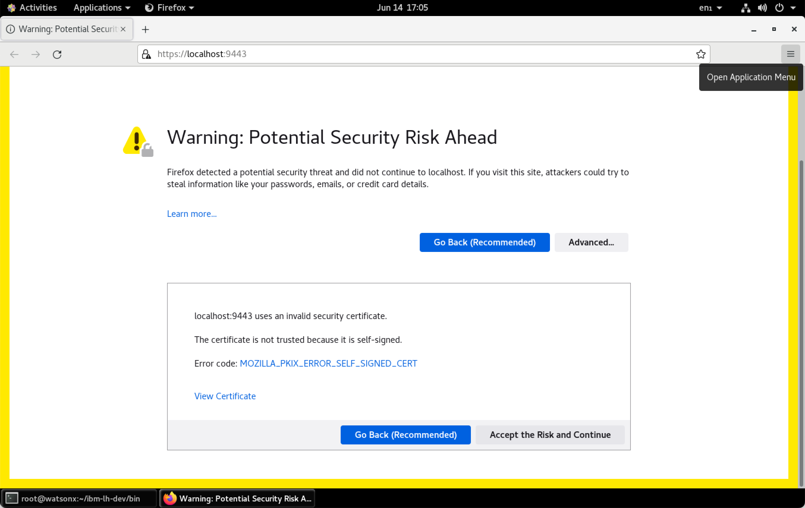
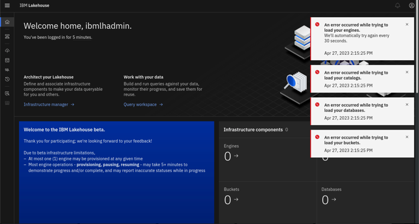

# Lab 2 - Starting IBM watsonx.data

The Developer package is meant to be used on single nodes. While it uses the same code base, there are some restrictions, especially on scale. In this lab, we will open some additional ports as well to understand how everything works. We will also use additional utilities to illustrate connectivity and what makes the IBM watsonx.data “open”. 

## Lab Instructions
Throughout the labs, any command that needs to be executed will be highlighted in a grey box:
```bash
cd /root/ibm-lh-dev/bin
```
Copy the text that is found within the box and paste it into the command window to execute. Note that some commands may span multiple lines, so make sure you copy everything in the box. Depending on your browser, you may see a copy icon on the far right side of the command.

### Start IBM watsonx.data Developer Edition
Make sure you are root and that you are in the development code bin directory.
```
cd /root/ibm-lh-dev/bin
```

Once you have switched to the development directory, you can start the IBM watsonx.data system. The <tt>LH_RUN_MODE</mark> flag is used to allow for non-SSL ports to be used in our development environment.
<code class="language-bash"><pre>
export LH_RUN_MODE=diag
./start.sh 
</pre></code>

The output will be like:
<pre style="font-size: small; color: green">
using /root/ibm-lh-dev/localstorage/volumes as data root directory for user: root/1001 
infra config location is /root/ibm-lh-dev/localstorage/volumes/infra

-- starting data plane containers...

==== starting: ibm-lh-minio ==== 
468339b93d94c78c1bb9bdcfe7f20ef0cc8d6c09725768847474b13bb51048e4
==== starting: ibm-lh-postgres ==== 
063643caeccd86f0612dbf587919f9b1c1681ab0e6632f04c7cd00bbd8f67596
==== starting: lh-hive-metastore ==== 
3d4ff7fb304fa4513642e289c290e3423827eef732d774c3be4229fe51601a9d
==== starting: ibm-lh-presto ==== 
3cc4313e53a784daf8b7747696bcd0260fe22d6abbaf8d749e50509d961066af

-- starting control plane containers...

==== starting: ibm-lh-control-plane-prereq ==== 
creating (if needed) db ibm_lh_repo
exists result: 
CREATE DATABASE
creating if needed, meta-repo tables in ibm_lh_repo
CREATE TABLE
CREATE TABLE
CREATE TABLE
CREATE TABLE
creating (if needed) db lakehouse-log
exists result: 
CREATE DATABASE
creating if needed, meta-repo tables in lakehouse-log
CREATE TABLE
==== starting: lhconsole-api ==== 
12fc73711934100cde1f6d4e633c28e2da0b9f4a804fe8923375669fcfeeb023
==== starting: lhconsole-javaapi ==== 
2c391fdcb68177346e6c73a26710da6101b9c19f52fa2ca2633a91bfcb95ae4c
==== starting: lhconsole-nodeclient ==== 
eca661eba3ba2fbef620438fe7986ebceb50c738bfdc0f08aeb3052e2560c8cb
==== starting: lhconsole-ui ==== 
efc6d69b051200ec85c2efd43dd884ec3a2e45304131065d1d7c09f3af464788
</pre>

### Check status of IBM watsonx.data
One the system has started; you can check the status with the following command.
```bash
./status.sh --all
```
Output will look like:
<pre style="font-size: small; color: green">
using /root/ibm-lh-dev/localstorage/volumes as data root directory for user: root/1001 
infra config location is /root/ibm-lh-dev/localstorage/volumes/infra
lhconsole-ui				running			0.0.0.0:9443->8443/tcp, :::9443->8443/tcp
lhconsole-nodeclient-svc		running			3001/tcp
lhconsole-javaapi-svc			running			8090/tcp
lhconsole-api				running			3333/tcp, 8081/tcp
ibm-lh-presto				running			0.0.0.0:8443->8443/tcp, :::8443->8443/tcp
ibm-lh-hive-metastore			running			
ibm-lh-postgres				running			5432/tcp
ibm-lh-minio				running			
</pre>

## Validate the Developer Installation
To confirm that the software is working, run the following commands to validate the installation.

### Presto Engine Test
Check the Presto engine by connecting to a schema. First, we need to make sure that the Presto engine has completed all startup tasks.
```
./checkpresto.sh
```
<pre style="font-size: small; color: green">
Waiting for Presto to start.
...........................
Ready
</pre>

**Note**: If the starting message appears to take too long (fills up the line with dots), kill the command (CTRL-C) and restart the IBM watsonx.data image (this rare event occurs because of resource contention in our small machine). 

To restart the image, issue the following commands.
```
export LH_RUN_MODE=diag
./stop.sh
./start.sh
./checkpresto.sh
```
Once the command returns "Ready" you can connect to the presto CLI.
```
./presto-cli.sh --catalog tpch --schema tiny
```
Check the record count of the customer table. 

**Note**: If the Presto engine has not yet started (you didn't run the checkpresto script), the next command may result in a useless Java error message. You may need to wait for a minute for attempting to run the statement again.
```
select * from customer limit 10;
```
Quit the Presto CLI. The Presto quit command can be used with or without a semicolon.
```
quit;
```
 
### IBM watsonx.data UI
Open your browser and navigate to:

   * IBM watsonx.data UI - https://ussouth.techzone-services.com:xxxxx
   * VMWare Image - https://localhost:9443/
   * Credentials: username: <mark>ibmlhadmin</mark> password: <mark>password</mark>

Note: You will get a Certificate error in Firefox:


 
Select Advanced.


 
Choose “Accept the Risk and Continue”. If you are using Google Chrome, you can bypass the error message by typing in “thisisunsafe”. 
  
  

**Note**: If you see the following screen when first connecting to the UX, this is an indication that the service has not completely initialized.


 
Dismiss all the error messages and then click on the Person icon (far right side above the messages) and Logout. Close the browser window after logging out and open the web page again until you get the proper login screen. At this point you will be connected to the console.
 
### Presto UI
Presto includes a browser interface. The PrestoDB console UI can be accessed from:

   * Presto console - http://ussouth.techzone-services.com:xxxxx
   * VMWare Image - http://localhost:8080/ui
   * Credentials: userid: None required
   
   
 
### dBeaver Client Tool
This is a client tool that we can use to connect to the IBM watsonx.data and execute queries etc. The tool has been installed in the watsonx users home directory. To access dBeaver, you must use one of the following options:

   * Use the Techzone guacamole interface and connect to the virtual machine console and deal with the pain and agony of using a non-resizable window.
   * Use the VNC service which has been installed on this server for you.
   * Use the native Linux Gnome terminal with VMWare/VirtualBox

### Retrieve SSL Certificates
Make sure you are still connected as root in your terminal session. We need to copy some keystore data into a temporary location to use with dBeaver connectivity. Make sure you are connected as root in a terminal session.

**Note**: We need two certificates from Presto to use with other query products (i.e., Apache Superset).
```
docker cp ibm-lh-presto:/mnt/infra/tls/lh-ssl-ts.jks /tmp/lh-ssl-ts.jks
docker cp ibm-lh-presto:/mnt/infra/tls/cert.crt /tmp/lh-ssl-ts.crt
```

### Start dBeaver Locally
To start dBeaver, you must be connected to the console of the Linux server as the watsonx user. You can either use the VNC interface or the local terminal UI of Linux. Open a new terminal window inside the virtual machine and run the following command.
```
./dbeaver/dbeaver
```
The start-up screen for dBeaver will display.

 
 
The dBeaver may ask if you want to create an empty database or update the release. Just say No.

The first dialog from dBeaver will ask you to create a database connection.


 
If you do not see this screen, select Database, and then select New Database Connection:
 
### Setup IBM watsonx.data connection from dBeaver
We will use the PrestoDB JDBC connector (NOT PrestoSQL). This is the other name for Trino, a variant of PrestoDB which might work. Select SQL (see Left side) and scroll down until you see PrestoDB. 
 
Select PrestoDB and then press “Next”. The following screen will be displayed.
 
Enter the following values into the dialog. 
**Note**: These settings are case sensitive.
``` 
Host=localhost
Port=8443
Username=ibmlhadmin
Password=password
Database=tpch
```
Then select the Driver Properties tab. You will be asked to download the database driver.
 
Make sure select “Force Download” otherwise it will not properly download the driver. Once downloaded it will display the Driver properties dialog.
 
Press the [+] button on the bottom left of the User Properties list.
 
You need to enter two properties:

   * SSL True
   * SSLKeyStorePath /tmp/lh-ssl-ts.jks

Enter the property name “SSL”, in uppercase (the parameter is case sensitive!). When you hit OK it will display the setting in the list.
  
Click on the SSL field and you will update the value to True and hit Enter.
Add another field called SSLKeyStorePath and give it value of /tmp/lh-ssl-ts.jks. The panel should now contain two values.

 
Press Finish when done. You should now see the TPCH database on the left panel.
 
Clicking on the >TPCH line should display the tables that are found in the database.
 
You can now use dBeaver to navigate through the different schemas in the Presto database.

## Local dBeaver Access
If you want to use a local copy of dBeaver, you will need to make some changes to your local system and the IBM watsonx.data system to connect. The instructions in the previous section require some slight modifications.
 
First locate the Presto connection port in your reservation document.

   * Presto Port - Server: eu-de.techzone-services.com Port: 35752

In a terminal window on your local machine, issue the following command to determine the IP address of your TechZone server.
```
ping eu-de.techzone-services.com
```
<tt fontsize=6>
PING eu-de.techzone-services.com (149.81.9.250): 56 data bytes
64 bytes from 149.81.9.250: icmp_seq=0 ttl=52 time=157.459 ms
</mark>
Note: Your server will be different! The FRA04 server is shown above.

This IP address needs to be placed into your local hosts file. On OSX, use the following command with the IP address found above.
```
echo '149.81.9.250 ibm-lh-presto-svc' | sudo tee -a /etc/hosts
```
In a terminal window on the IBM watsonx.data server, issue the following commands:
```
sudo firewall-cmd --add-port={8443/tcp,5432/tcp} --permanent --zone=public
sudo firewall-cmd --reload
```
In your connection properties in dBeaver, use the following values:
```
Host=ibm-lh-presto-svc
Port=8443
Username=ibmlhadmin
Password=password
Database=tpch
```
And remember to add these connection properties.

   * SSL True
   * SSLKeyStorePath /tmp/lh-ssl-ts.jks
   
You should now be able to connect to the Presto engine using your local dBeaver software.

